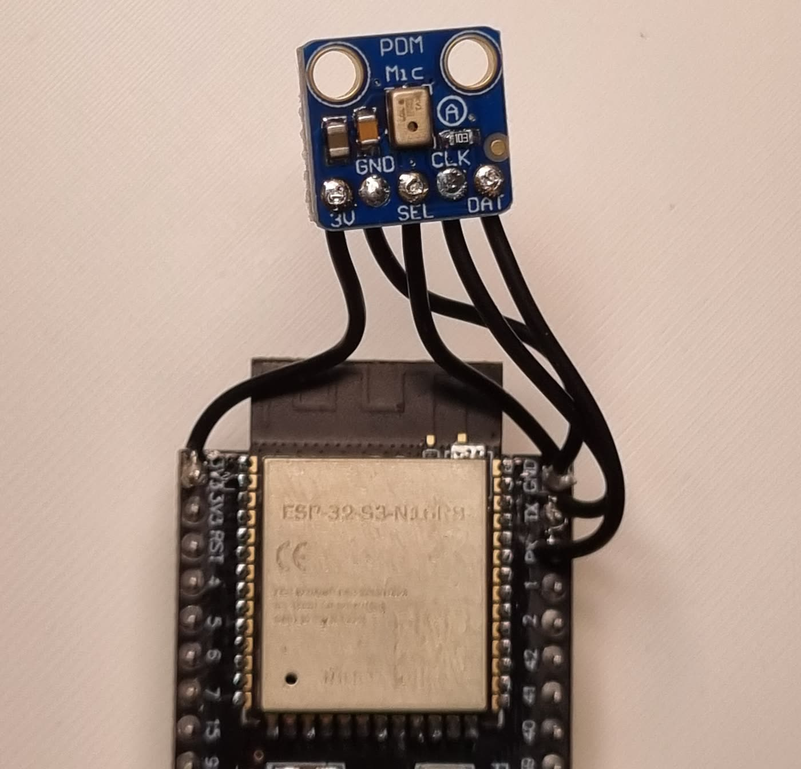

# Audio Guide — sound driving the four knobs

The **Audio edition** makes sound one of the things that can turn the knobs.
Any pattern that responds to the knobs responds to sound — patterns never
know where knob values come from.

There are two main ways in, and this guide covers both: the **Chrome
extension** (any browser tab becomes the source) and the **on-board
microphone** (a $5 part and four solder joints, and the panel hears the
room with no computer involved). A phone app exists too — it's covered
briefly at the end — and if you work in Ableton, TouchDesigner or anything
else that can speak OSC, that path has [its own section](#osc--ableton-today-anything-tomorrow).

Like the [Feature Guide](FEATURE_GUIDE.md), this page ends with a section
written for AI coding agents; everything above it is for people.

---

## Getting the Audio edition

Any of these puts the same firmware on your panel:

- **One click:** [patternflow.work/variants](https://patternflow.work/variants)
  → Audio → flash from the browser.
- A release's `patternflow-audio.ino.bin` via the console's `/update` page.
- Build it yourself: `./firmware/bundles/build.sh audio` (add
  `flash <hostname>` to send it over Wi-Fi).

The edition bundles three features: **OSC** (Max/TouchDesigner/Ableton, see
[`docs/osc-spec.md`](docs/osc-spec.md)), **audio** (the streaming path the
extension uses) and **audio_in** (the microphone and the mapping engine).

## The Chrome extension

The fastest way to try sound. It captures whatever a browser tab is playing
— YouTube, SoundCloud, a DJ set, your DAW's browser monitor — analyzes it
locally, and streams four knob lanes to the panel over your LAN.

**Install:** it's not on the Web Store — load it straight from this repo.
`chrome://extensions` → enable *Developer mode* → *Load unpacked* → pick
[`tools/patternflow-audio-extension/`](tools/patternflow-audio-extension/).
(Details and screenshots in its [README](tools/patternflow-audio-extension/README.md).)

**Use:** open a tab with sound → click the extension → **Start** (it captures
the active tab) → enter your panel's address (`patternflow.local` or its IP)
→ the knobs move with the music.

**Then open the editor** (*Editor ↗* in the popup) — this is where it gets
good. Each of the four knobs is a **box drawn on the live spectrum**: the
box's width is the frequencies it listens to, its height the loudness window
it maps. Drag a box over the bass and knob 1 becomes a bass knob. Inside
each box a **response curve** (presets or a hand-dragged bezier) shapes how
it moves, an **output range** decides how far, and **attack/damping** set
the ballistics — fast rise, slow fall. Boxes start in **auto**, breathing
with the music; grab an edge to take manual control. A **preview** popup
shows how a test signal would ride your settings before you commit.

Boxes map to knobs 1:1 and that's fixed on purpose — box 2 *is* knob 2.

## The on-board microphone



A small PDM microphone soldered to the DevKit lets the panel react to the
room itself — no browser, no phone, nothing else running. This is an
optional add-on: the firmware ships with the mic **off** and costs nothing
until you build and enable it.

### What to buy

| Part | What to look for | Notes |
| --- | --- | --- |
| PDM MEMS microphone breakout | **Adafruit PDM MEMS Microphone Breakout #3492** (MP34DT01-M), or any clone whose pin row reads **3V · GND · SEL · CLK · DAT** | ~$5. This is the one in the photo. |
| Hookup wire | 4 thin leads, ~10 cm | Shorter is better — see routing note below. |

**Don't buy these instead:** an **INMP441** or other standard I²S mic (it
needs three signal pins — this board has exactly two free), or an analog
electret module (no ADC pin is free at all). It must be **PDM**.

### Wiring

Four leads, five pads:

```
   mic breakout                 ESP32-S3 DevKit
   ┌──────────────┐
   │  3V   ───────┼──────────────►  3V3
   │  GND  ───────┼──────────────►  G   (GND)
   │  SEL  ───────┼──┐
   │  CLK  ───────┼──┼───────────►  TX  (GPIO 43)
   │  DAT  ───────┼──┼───────────►  RX  (GPIO 44)
   └──────────────┘  │
                     └──────────►  GND   ← SEL goes to ground
```

- **Don't forget SEL → GND** — jumper it to the breakout's own GND pad so it
  shares the same lead. It selects the LEFT channel, the slot a mono read
  uses; tied high, the mic reads silence while looking perfectly healthy.
- The DevKit silkscreen says **TX / RX**, not 43/44 — those are the ones.
  They're free because the console talks over native USB, and they are the
  only two unclaimed pins on the whole board.
- 3V3 and GND appear several times on the headers; use whichever is closest.

**How to physically do it** — the DevKit sits in sockets, so you never touch
the main board:

1. **Pull the DevKit out** of its sockets (straight up).
2. Solder the thin wires on the **top side**, where the header pins poke
   through the module — four spots: TX, RX, 3V3, GND (that's what the photo
   shows).
3. Route the wires out the top and plug the DevKit back in.

Fully reversible — to undo it, just remove the wires. Two cautions: while
the mic is wired, **don't plug a cable into the DevKit's UART-side USB
port** (that port's bridge chip shares the TX/RX pins — use the native USB
port, which is the one the console uses anyway). And the mic leads run near
the panel's ribbon lines; in practice this is fine (the assembled device
reads clean with the panel running), but if you ever see the picture in the
audio, shorter leads routed away from the ribbon are the first fix.

Stick the mic wherever sound reaches it. Done.

### Turn it on

Console → **Audio** page (`/audio-in`) → flip **Microphone** on. That's the
whole switch: on means listening and driving the knobs, off releases the
hardware completely. The **gain** slider (1–16, default 8) is there if your
room runs quiet — PDM mics on this chip are famously low-amplitude, and gain
is the official answer.

The same box editor from the extension lives on this page, dark-themed —
same boxes, same curves. Mic settings are stored **on the panel** and
survive reboots and firmware updates; *Reset all* puts everything back.

### If something's off

- **Silence, but everything looks healthy** → SEL isn't grounded. This is
  the classic one.
- **Mic not detected** → the firmware notices an absent/miswired mic and
  falls back to a synthetic test source, and says so on `/api/status`.
- **The top band barely moves at normal volume** → physics, not a fault:
  at room levels the highest octaves carry almost no energy. The auto range
  is tuned around this.

## The phone app (for filming)

[`tools/patternflow-audio-android/`](tools/patternflow-audio-android/) is a
small Android app that captures whatever the phone is playing and drives the
panel with it. It exists for one job: **filming content** — play a track on
the phone (reels, whatever), and the panel reacts to the same audio the
video records. For everyday listening the extension or the mic is the better
path.

It's not on any store — build and install it yourself; the
[README](tools/patternflow-audio-android/README.md) has the full recipe. It
opens the panel's own editor page for configuration, so everything above
about boxes and curves applies unchanged.

## OSC — Ableton today, anything tomorrow

The edition also speaks **OSC** — plain OSC 1.0 over UDP, both directions.
The ready-made client is the **Max for Live bridge** in
[`integrations/ableton/`](integrations/ableton/): load it in Ableton and
your set and the panel talk to each other.

But the bridge is just one client of a written contract,
[`docs/osc-spec.md`](docs/osc-spec.md) — anything that can send a UDP OSC
message can drive the panel the same way. TouchDesigner, VCV Rack and
Processing speak it natively; Blender does through an OSC add-on or a few
lines of Python. Send `/patternflow/ping` once and the device learns your
address and starts streaming the other way too — encoder turns and button
presses arrive as OSC events, so the panel's knobs can drive *your* software
just as well. Build against the spec, not the firmware source; that's what
it's for.

## When several sources are live

A hand on an encoder beats everything. The extension/app stream beats the
microphone on any lane it's driving. The mic takes whatever's left. So you
can leave the mic on and still grab a knob whenever you want — it comes back
to the music a few seconds after you let go.

One thing to know: the **extension keeps its mapping in the browser**, while
the **mic and the phone app share the config stored on the panel**. Same
editor everywhere, two homes for the settings.

---

## For the AI agent

You were pointed here to work on Patternflow's audio path. The map:

**Firmware — the mapping engine and mic**
([`firmware/patternflow/features/audio_in/`](firmware/patternflow/features/audio_in/)):

| file | role |
| --- | --- |
| `feature_audio_in.h` | Descriptor, the sampling/analysis task, where levels enter the knob pipeline. |
| `core_audio_pdm.h` | PDM mic driver (GPIO 43/44). Its header comment is the authoritative wiring + driver-choice record. |
| `core_audio_fft.h` | FFT and spectrum buckets. |
| `core_audio_in_map.h` | Bands, curve LUTs (33-point, interpolate-only), attack/damping glide, auto-range, NVS persistence. |
| `core_audio_in_http.h` | `/audio-in` (editor page), `GET/POST /api/audio-in` (whole config), `POST /api/audio-in/reset`, the `?levels=1` live poll, and the frame endpoint the phone posts spectra to. |
| `audio_in_index.h` | **Generated** — never edit (chain below). |

**Firmware — the stream path**
([`firmware/patternflow/features/audio/`](firmware/patternflow/features/audio/)):
`core_audio_ws.h` is a WebSocket server on port 81. The wire contract is
[`docs/audio-ws-spec.md`](docs/audio-ws-spec.md) — clients build against the
spec, not the source. Probe `GET /api/status` for `"audio"` in `caps`.

**The editor is authored once and baked down.** Edit at the top, regenerate
downward; CI (`console-sync.yml`) fails on drift:

```
tools/patternflow-audio-extension/editor.{js,html,css}      ← edit here
  → python firmware/toolchain/build_audio_in_page.py        (dark theme + device adapter)
  → firmware/patternflow/console/audio-in.html
  → python firmware/toolchain/console_pages.py build
  → firmware/patternflow/features/audio_in/audio_in_index.h
```

**Chrome extension**
([`tools/patternflow-audio-extension/`](tools/patternflow-audio-extension/)):
`editor.js` is the single shared editor module (adapter-isolated —
`editor-adapter.js` binds chrome storage/frames, and includes a synthetic
demo mode when opened outside the extension). `offscreen.js` does FFT →
band mapping → glide → WS send. `popup.*` is the capture console;
`background.js` owns capture lifecycle. Extension config lives in
`chrome.storage`, not on the panel.

**Android app**
([`tools/patternflow-audio-android/`](tools/patternflow-audio-android/)):
`Analyzer.kt` mirrors `offscreen.js`'s math; `DeviceLink.kt` speaks the WS
contract + syncs panel config over `/api/audio-in` + posts monitor frames;
`CaptureService.kt` is the playback-capture foreground service;
`EditorActivity.kt` is a WebView onto the panel's `/audio-in`. Build recipe
in its README.

Rules of the road: firmware changes follow [FEATURE_GUIDE.md](FEATURE_GUIDE.md)
(hooks, checkers, `build.sh all`); protocol changes update the spec in the
same PR; editor changes regenerate the chain above and keep the extension
and console page identical — they are the same file, which is the point.
