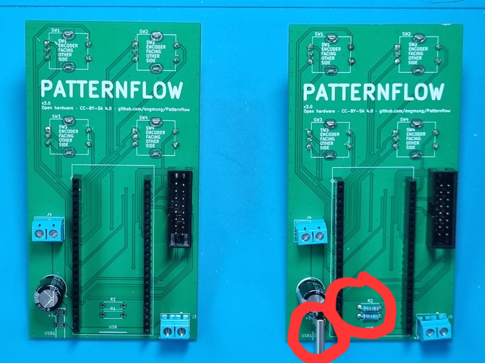
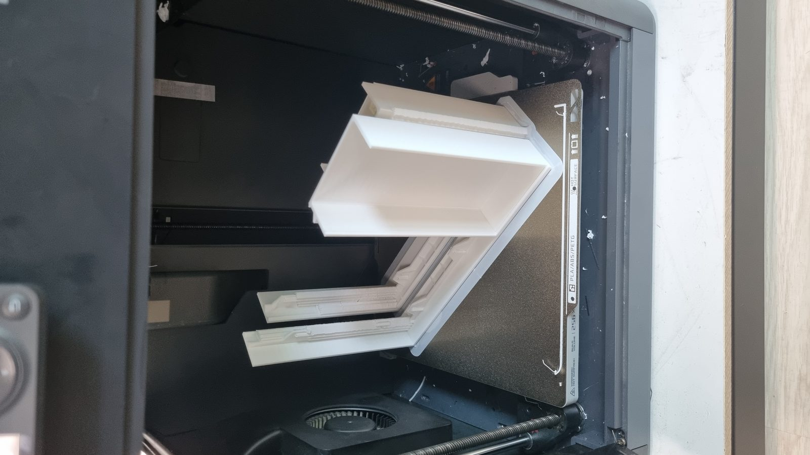
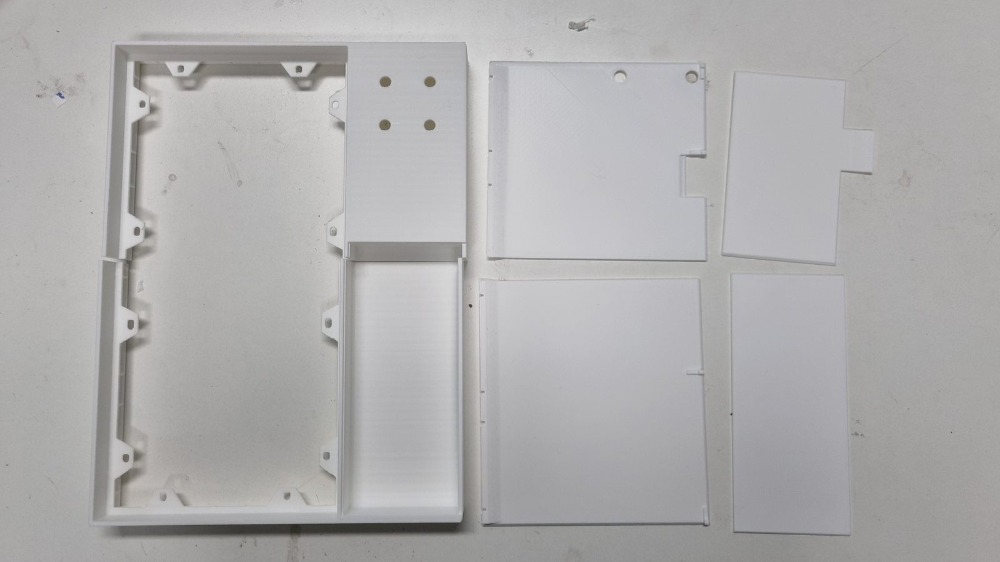
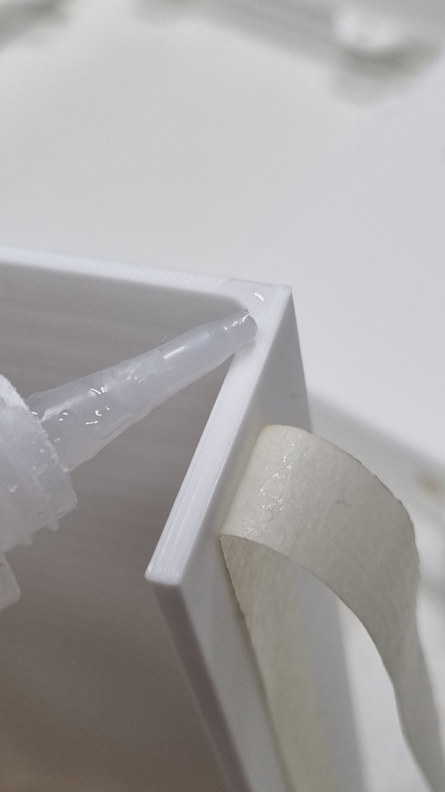
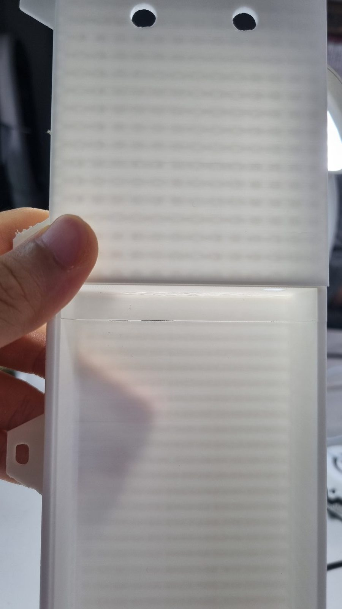
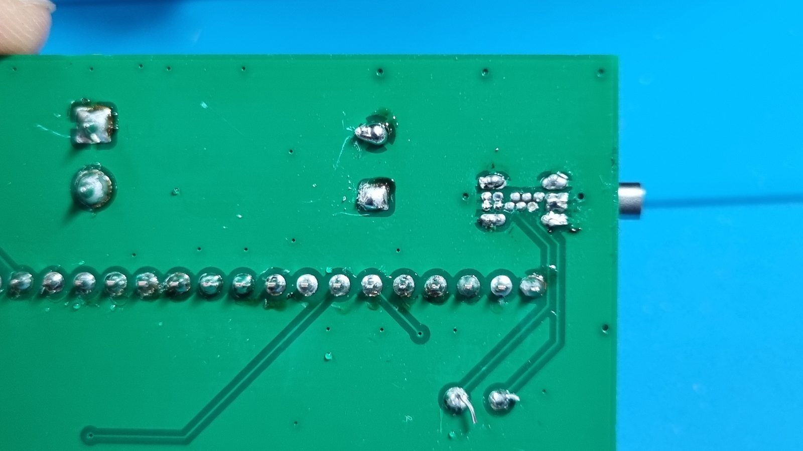
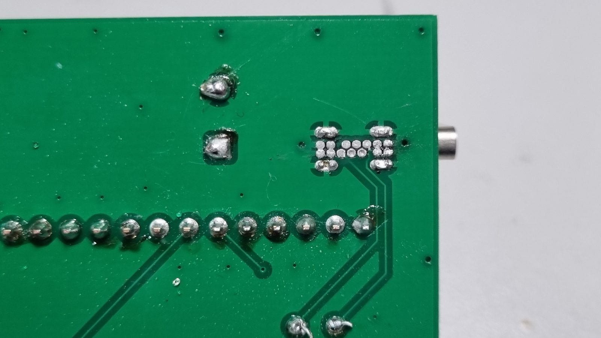
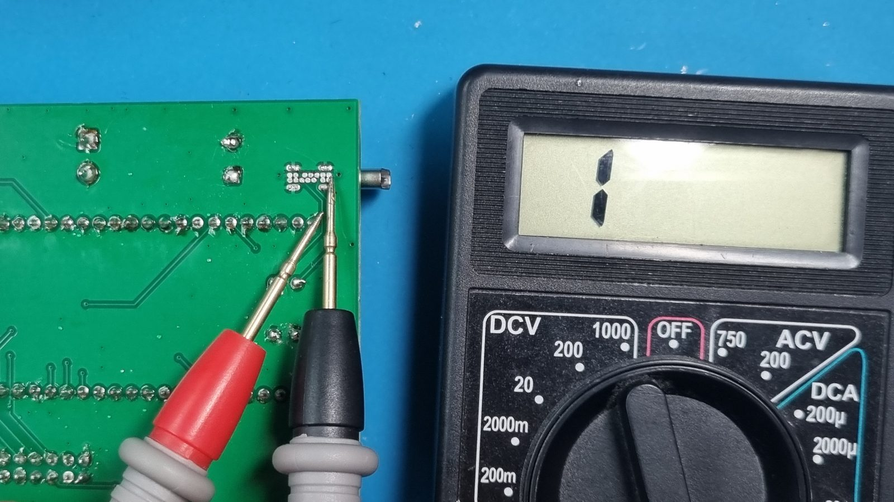
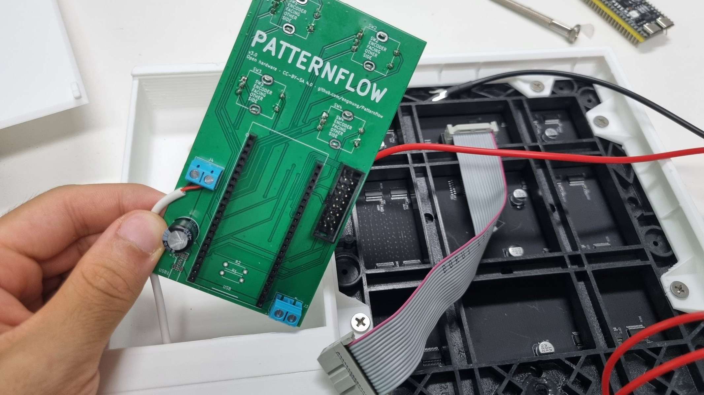

# Patternflow v3.0.0 -- Build Guide

> **Building a v2.x board?** Use the [v2 build guide](BUILD_GUIDE_v2.md) instead — v2 and v3 parts are **not** interchangeable.

This guide walks you through building a Patternflow v3.0.0 from scratch. It assumes basic familiarity with through-hole soldering and 3D printing.

**Estimated build time:** 3–5 hours of active work, plus ~10 hours of 3D printing.

**What's new in v3** (vs. v2.x):

- **Simple screw-terminal power** — strip a USB cable, screw two wires in, done. (A USB-C input is on the board too, but it's **on hold pending a fix** — see Section 2.)
- **No SMD passives** — every part you solder is through-hole
- **Snap-fit enclosure** — the back panel clicks shut, wall-mount holes are built in, and the LED matrix needs no bump trimming
- Smaller board. **v2.x boards do not fit v3 cases, and vice versa.**

## Table of Contents

1. [Bill of Materials](#1-bill-of-materials-bom)
2. [Power Input — Screw Terminal Only](#2-power-input--screw-terminal-only)
3. [Order the PCB](#3-order-the-pcb)
4. [3D Printing](#4-3d-printing)
5. [PCB Assembly](#5-pcb-assembly)
6. [Case Assembly](#6-case-assembly)
7. [Wiring & First Power-Up](#7-wiring--first-power-up)
8. [Firmware](#8-firmware)
9. [Final Checks](#9-final-checks)
10. [Known Issues & Design Notes](#10-known-issues--design-notes)

---

## 1. Bill of Materials (BOM)

The authoritative parts list is [`hardware/bom/bom_v3.0.csv`](hardware/bom/bom_v3.0.csv) — every part specified by manufacturer part number. Read the [BOM README](hardware/bom/README.md) for sourcing notes before ordering.

Rough breakdown of the ~US$100 total: 3D printing filament ~$30, LED matrix panel ~$20, ESP32-S3 ~$13, PCB + remaining parts (encoders, connectors, etc.) ~$35.

### On the board

| Ref | Qty | Part | Spec | MPN (Manufacturer) | Notes |
| --- | --- | --- | --- | --- | --- |
| U1 | 1 | ESP32-S3 DevKit | N16R8, 44-pin, 25.4mm row spacing | ESP32-S3-DevKitC-1-N16R8 (Espressif) | AliExpress modules are usually fine too (see the GPIO0 note, §5). Plugs into sockets — never soldered. |
| — | 2 | Female pin socket | 1×22, 2.54mm | PPPC221LFBN-RC (Sullins) | Soldered into the U1 rows; the DevKit rides on top. |
| SW1–SW4 | 4 | Rotary encoder w/ switch | EC11, 5-pin, 20mm shaft | PEC11R-4220F-S0024 (Bourns) | Insert from the **back** of the board. Cheap EC11 packs work but fail more often. |
| USB1 | — | USB-C receptacle | — | — | ⏸️ **On hold — leave unpopulated for now.** The USB-C input isn't running reliably yet; a fix is in progress (Section 2). |
| R1, R2 | — | Resistor 5.1kΩ | — | — | ⏸️ **On hold** — these are the USB-C CC pull-downs; skip them while `USB1` is on hold. |
| J1 | 1 | Box header | 2×8, 2.54mm, vertical | 61201621621 (Würth) | HUB75 ribbon from the panel plugs in here. Match silkscreen orientation. |
| J3 | 1 | Screw terminal | 2-pin, 5.0mm | TB002-500-02BE (CUI Devices) | +5V out to the panel. Every build needs it. |
| J4 | 1 | Screw terminal | 2-pin, 5.0mm | TB002-500-02BE (CUI Devices) | **Power input** (back of board). Required on every build. |
| C11 | 1 | Electrolytic cap | 1000µF 16V, radial D10×L13 | 16PX1000MEFC10X12.5 (Rubycon) | **Observe polarity.** |

### Off the board

| Qty | Part | Notes |
| --- | --- | --- |
| 1 | LED matrix panel — HUB75, 128×64, P2.5, 320×160mm | **Recommended: [Full color 320×160mm P2.5 HUB75 — AliExpress](https://s.click.aliexpress.com/e/_c3SVdcQr)** (affiliate link — supports Patternflow at no extra cost). Its mounting-screw positions are the verified match for the case, and it ships with the ribbon + power cable you'll use. Other panels can work — see the sourcing rules below **before** buying one. |
| 12 | M4 screw, ~10mm | Panel mounting — **sized for the linked panel.** Using a different panel? Buy whatever screws *its* mounting holes take (and see the `for_other_panels/` case note in Section 4). |
| 1 | Sacrificial USB cable (it gets cut) | Power feed into `J4` |
| 1 | USB power bank, 5V | Must fit the case compartment |

Key sourcing rules (details in the BOM README):

- **LED matrix panel: the linked listing is the verified, zero-surprises path** — the case is dimensioned around that exact panel. You're free to buy a different one, but **check two things first**: ① the driver IC must be 74HC595 / FM6126A / FM6124 (GCLK "video wall" panels — FM6363C/FM6373C, "3840Hz", "needs a receiving card" — stay completely dark); ② compare its mounting-screw positions against the case — if they differ, print the adjustable-mount version (Section 4) or **adapt the enclosure yourself** from the Blender source (`hardware/case/source/`). Verify before you buy, not after.
- **ESP32-S3**: Espressif is the reference part, but AliExpress modules are usually fine — if yours hits the cold-boot issue, one 10k resistor fixes it ([#16](https://github.com/engmung/Patternflow/issues/16)).
- **Encoders**: any 5-pin EC11 with a push switch works — the cheapest packs just fail more often. Reference part: Bourns PEC11R-4220F-S0024 (20mm shaft — print the matching knob file).
- **USB-C connector**: not needed for now — the USB-C input is on hold while it's fixed and tested (Section 2). Skip it unless you're deliberately helping test that path.

### What you also need (not in BOM)

- 3D printer (256 mm bed is enough — see Section 4)
- White and black PLA filament
- Soldering iron, solder, flux, tweezers
- Wire cutters, Phillips screwdriver, small flathead (screw terminals)
- CA glue (bonding the printed halves — Section 4)
- Putty or baking soda + CA glue (optional seam filling, Section 4)

## 2. Power Input — Use the Screw Terminal

**Power the board through `J4`, the 2-pin screw terminal on the back.** Strip a USB cable, clamp the two wires in, done. That's the whole procedure, and it's what every build in this guide uses.

> ⏸️ **The USB-C input (`USB1`) is on hold — don't use it for now.** The board carries a USB-C footprint, but it isn't running reliably yet, so **leave `USB1`, `R1`, and `R2` unpopulated** until this note says otherwise. It's being reworked and re-tested; the guide will be updated when it passes.
>
> **What happened** ([#221](https://github.com/engmung/Patternflow/issues/221)): a board powered through USB-C ran **completely fine for 20–30+ minutes** — no heat, no symptoms — and then suddenly started **smoking at one of the connector pins**, rapidly frying the receptacle and the power path around it. It is still open whether that's a hand-soldering defect on those tight-pitch pins or a structural limit of this 14-pin THT part under the LED matrix's peak current.
>
> ⚠️ **This is why "it seems to work" proves nothing here.** The failure is *delayed* — passing your multimeter checks and running for half an hour does not mean the joint is safe. Until the cause is pinned down, don't put this input into service.
>
> The screw terminal has none of this history — it's the original, proven Patternflow power input, and it's exactly as capable.

| | **`J4` — screw terminal** |
|---|---|
| Populate | `J4` (2-pin screw terminal, back of board) |
| Power cable | Any USB cable, stripped, wires screwed in (see Section 7) |
| Difficulty | Easy — a screwdriver, no soldering iron |
| Leave empty (for now) | `USB1`, `R1`, `R2` |

***Build the board on the left.*** `J4` carries the screw terminal; `USB1` and the `R1`/`R2` pads stay bare. The board on the right has the USB-C receptacle and its CC pull-downs populated (circled) — **hold off on that configuration for now.**

## 3. Order the PCB

The easiest way is the **PCBWay shared project** — no Gerber upload needed, and ordering through it supports Patternflow development:

Any fab works, though — upload **`hardware/pcb/gerber/patternflow_v3.0_gerber.zip`** to the fab of your choice (JLCPCB tends to be the cheapest), or start from the KiCad source in `hardware/pcb/kicad/`.

> ⚠️ **v3.0 only.** Do not order v2.1 for this guide — the v2.1 board is a different size and **will not fit the v3 cases**. Anything in `hardware/pcb/gerber/experiment/` is unverified; don't order it either.

## 4. 3D Printing

**Bambu / MakerWorld users — this section is one click:** the case lives on **[MakerWorld](https://makerworld.com/ko/models/3072492-patternflow-open-source-led-synthesizer-case#profileId-3459015)** with tuned print profiles (the same 4-plate project is in the repo as [`hardware/case/patternflow_v3.3mf`](hardware/case/patternflow_v3.3mf)). Slicing manually instead? Case folders are named by **printer bed size** — see [`hardware/case/`](hardware/case/):

| Your printer bed | Print | Notes |
|---|---|---|
| **256 mm** (P1S / X1C / A1 class) | `bed_256mm/encloser.stl` | Body frame, back panels, and LED-panel mount in one STL. **White PLA.** ~10 h total. |
| **~330 mm+** (H2S class) | `bed_330mm/encloser.stl` | The one-piece original — body, closing part, and LED-panel mount in one STL, **no bonding at all**. **White PLA.** |
| **Everyone** | `knobs/knobs_20mm.stl` | **Required for every build** — all four knobs in one plate, as its own separate print job. **Black PLA.** (15 mm-shaft encoders → `knobs_15mm.stl`.) |

Two colors, on purpose: **body in white, knobs in black** — that contrast is the Patternflow look. Printing the knob plate as a separate job keeps it simple (no color changes mid-print).

> **Using a different LED panel than the BOM link?** Panel suppliers drill mounting holes in different places. Print `bed_256mm/for_other_panels/divided_v3_part1..5.stl` instead — its LED-mount part adjusts to varying bolt-hole positions ([#169](https://github.com/engmung/Patternflow/issues/169)-verified). Even so, check the mount against your panel before committing: a very different hole layout may still not fit.

### Print settings

- Nozzle 0.4 mm, layer height 0.2 mm, standard supports (not tree), brim off, aux fan ~20% (Bambu P1S default profile works as-is)

 

*Left: `encloser.stl` on a P1S bed. Right: everything that comes out of the one print — body frame, back panels, battery cover, and the LED-panel mounting part.*

### Bond the printed halves — right after printing

The 256 mm print splits the **enclosure frame** and the **back panel** into upper and lower halves. As soon as the parts are off the bed, glue each pair together with CA glue — masking tape holds them while curing (left). Backlit (right), a bonded seam shows a hairline gap — that's normal, and putty or baking soda + CA glue fills it:

 

**Let the glue cure while you solder the PCB (Section 5).** By the time the board is done, the enclosure is ready.

## 5. PCB Assembly

### ▶️ Video: the entire soldering process, start to finish

The whole PCB assembly is covered in **one YouTube video** — soldering order included, so there's no separate step list here. Click to watch:

**[▶ Watch on YouTube — Patternflow v3.0 PCB soldering walkthrough](https://youtu.be/NZCjMBCsDAc)**

All parts are through-hole, and the video covers the complete order.

> ⏸️ **Skip the USB-C connector for now.** The video shows `USB1` being soldered (11:00–15:18) — it was filmed before that input went on hold. **Leave `USB1`, `R1`, and `R2` unpopulated** (Section 2); everything else in the video applies exactly as shown.
>
> And this is why those pins deserve respect whenever the input does come back — the pitch is tight enough that a bridge is easy to make and hard to spot ([#221](https://github.com/engmung/Patternflow/issues/221)):
>
> | ❌ A bridge like this shorts +5 V to ground | ✅ What a clean joint looks like |
> |---|---|
> |  |  |

Before first power, go over your joints with a multimeter:

Don't plug the ESP32 DevKit in until after the first power check (Section 7).

<b>ESP32 pin reference</b> — the full 44-pin map. You don't need it for a normal build; it's here for debugging and derivative designs.

Extracted from the v3.0 netlist (identical functions to v2.x — the same firmware runs on both):

| # | Pin | Function | | # | Pin | Function |
| --- | --- | --- | --- | --- | --- | --- |
| 1 | 3V3 | +3.3V supply | | 23 | GND | GND |
| 2 | 3V3 | NC | | 24 | TX | NC |
| 3 | RST | NC | | 25 | RX | NC |
| 4 | IO4 | ENC1_A | | 26 | IO1 | ENC4_SW |
| 5 | IO5 | ENC2_A | | 27 | IO2 | HUB_CLK |
| 6 | IO6 | ENC3_A | | 28 | IO42 | HUB_R1 |
| 7 | IO7 | ENC4_A | | 29 | IO41 | HUB_G1 |
| 8 | IO15 | ENC2_SW | | 30 | IO40 | HUB_B1 |
| 9 | IO16 | ENC3_B | | 31 | IO39 | HUB_G2 |
| 10 | IO17 | ENC3_SW | | 32 | IO38 | HUB_R2 |
| 11 | IO18 | ENC4_B | | 33 | IO37 | NC (PSRAM internal) |
| 12 | IO8 | ENC1_B | | 34 | IO36 | NC (PSRAM internal) |
| 13 | IO3 | NC | | 35 | IO35 | NC (PSRAM internal) |
| 14 | IO46 | HUB_A | | 36 | IO0 | NC — boot strap (see note) |
| 15 | IO9 | ENC1_SW | | 37 | IO45 | NC |
| 16 | IO10 | ENC2_B | | 38 | IO48 | HUB_C |
| 17 | IO11 | HUB_B | | 39 | IO47 | HUB_LAT |
| 18 | IO12 | HUB_D | | 40 | IO21 | HUB_E |
| 19 | IO13 | HUB_B2 | | 41 | IO20 | NC |
| 20 | IO14 | HUB_OE | | 42 | IO19 | NC |
| 21 | 5V | +5V input | | 43 | GND | GND |
| 22 | GND | GND | | 44 | GND | GND |

> **GPIO0 / cold-boot note.** The v3.0 board leaves GPIO0 unconnected (no pullup pad). Most modules boot reliably that way, but some show cold-boot lockups from the floating strap pin ([#16](https://github.com/engmung/Patternflow/issues/16)). If yours consistently needs a RESET press after power-on, apply the on-module 10k GPIO0→3.3V fix photographed in that issue — one resistor and it's solved.

## 6. Case Assembly

### ▶️ Video: from printed parts to first power-on

Sections 6, 7, and 9 are covered in **one YouTube video** — the full assembly, wiring, and first boot. Click to watch:

**[▶ Watch on YouTube — Patternflow v3.0 assembly & first power-on](https://youtu.be/J9C9bZgkNKs)**

By now the enclosure halves you bonded in Section 4 have cured and the board is soldered — time to bring them together. The video above walks every step; in writing:

> Printed the **330 mm one-piece body**? Everything in this section is identical — the only thing you skipped is the bonding step in Section 4.

1. **Seat the LED panel in the enclosure with its `HUB-75E IN` connector toward the top** — that's the side the ribbon reaches `J1` from. ⚠️ The panel insertion is very tight — near-zero clearance. Work it in slowly.

2. **Fit the LED-panel mounting part and tighten the screws.** The mounting part is a separate piece precisely because panel bolt-hole positions vary between suppliers — match it to your panel first.

3. **Set the board into its bay and secure the encoders from the front**: attach each encoder's nut and tighten with a wrench or pliers — this locks the board against the front face.

### Finishing touches

- The power bank slides into the internal compartment behind the board bay.
- The four black knobs press-fit onto the encoder shafts — save them for **last**, after the Section 9 checks pass.

## 7. Wiring & First Power-Up

1. Connect the HUB75 ribbon from `J1` to the panel's `IN` connector.
2. Wire `J3` to the panel's power cable (+5V / GND — double-check polarity). The wiring run is shown at **06:57** in the [assembly video](https://youtu.be/J9C9bZgkNKs).
3. Power: stripped USB cable into `J4` (red = +5V, black = GND).

   **Do it in this order, it's much easier:**

   1. Cut the USB cable and **strip the two power wires** (red = +5 V, black = GND; ignore the data wires).
   2. **Thread the cable through the enclosure's cable hole first** — before it's attached to anything.
   3. **Clamp the stripped wires into `J4`** on the board and tighten the screws. Give each wire a gentle tug to confirm it's held.
   4. *Then* fit the board into the enclosure. Doing it this way means you're never fishing a cable through a hole with the board already in place.

   

   *Cable already through the enclosure hole, wires clamped into `J4`, board about to go in.*
4. **Before inserting the ESP32:** with power disconnected, continuity-check +5V↔GND at the `J3` terminals (open = good, like the Section 5 check). Then power up once and confirm ~5V across `J3`.
5. Power off, seat the ESP32 DevKit in its sockets (orientation per silkscreen), power on.

## 8. Firmware

The ESP32-S3 module is flashed **separately, outside the PCB**. Already seated it? Just pop it gently out of the sockets, flash it, plug it back in, and connect power — done. **One firmware image serves every board generation** — the pin map is identical on v2.x and v3.0, so there is no board selection to get wrong.

### 8.1 Browser flash (recommended)

No installation required — desktop **Chrome or Edge** only (Web Serial; Firefox/Safari won't work).

> 🔌 **Use the LEFT USB-C port** — the one on your left when the two ports face you. On the ESP32-S3 DevKit that's the board's **native USB** port (labeled `USB`); the browser flasher (Web Serial + Improv) talks to it directly. The right-hand port goes through a separate USB-to-UART bridge chip and is the one Arduino IDE uses (§8.2) — the browser flasher won't see the board on that one.

1. Visit **[patternflow.work](https://patternflow.work)** on a desktop browser.
2. Connect the ESP32-S3 to your computer with a USB-C **data cable**, using the **left port** (see above).
3. Scroll to the **Patterns** section, click **"Flash Patternflow OS"**, pick the serial port, and follow the on-screen steps. Wi-Fi can be provisioned right there too (Improv-Serial).
4. Disconnect, seat the module back into the board sockets (orientation per silkscreen), and connect power.

> 📶 **Changing Wi-Fi later.** The network you set during flashing is **saved on the device and reused on every boot** — it stays until you overwrite it. To move Patternflow to a different Wi-Fi, either **re-flash from the browser** (you'll set the new network during Improv provisioning), or in Arduino IDE do a **full erase** (Tools → *Erase All Flash Before Sketch Upload* → *Enabled*) and re-upload. A plain re-upload does **not** clear the stored credentials.

 

*Photos from the v2 guide — the flashing flow is identical on v3.*

### 8.2 Arduino IDE (custom builds)

> 🔌 **Use the RIGHT USB-C port** for Arduino IDE — the one on your right when the ports face you, labeled `UART`/`COM`. It's the USB-to-UART bridge Arduino uploads through; the left (native `USB`) port is for the browser flasher (§8.1). If the IDE doesn't see a serial port, you're likely on the wrong one.

- Board settings: *ESP32S3 Dev Module*, PSRAM: *OPI PSRAM*, Flash: *16MB*, USB CDC On Boot: *Enabled* — full setup in [`firmware/README.md`](firmware/README.md). CDC On Boot is what puts the browser flasher's Wi-Fi setup on the left `USB` port; with it disabled that step moves to the other socket.
- If your panel's driver IC is FM6126A/FM6124, set `PANEL_PROFILE` to `PANEL_HIGHREFRESH` in `config.h` (default `PANEL_STANDARD` covers 74HC595).
- To wipe stored Wi-Fi credentials, enable **Tools → Erase All Flash Before Sketch Upload** before uploading (see the Wi-Fi note in §8.1).
- **ArduinoOTA** works over Wi-Fi after the first join — functional, but the flasher and wired upload are the primary paths.

### Want OSC / Ableton control? Build it yourself once

The stock flasher image ships with **OSC disabled at compile time** — live control (the [Ableton bridge](integrations/ableton/), or any OSC host) needs one custom build with your Wi-Fi credentials baked in:

1. Download this repo and open `firmware/patternflow/patternflow.ino` in Arduino IDE.
2. In the same folder, copy `patternflow_secrets.example.h` → `patternflow_secrets.h`, fill in your Wi-Fi SSID/password, and enable what you want (e.g. `PF_OSC_ENABLED 1`). The file is gitignored, so your credentials stay local.
3. Set up the IDE following [`firmware/README.md`](firmware/README.md) — ESP32 board package, libraries, and the board settings above.
4. **First upload is wired**: plug the USB cable into the DevKit's port labeled **COM** (not the one labeled USB) and hit Upload. Once that first flash joins your Wi-Fi, later uploads can go wireless via ArduinoOTA.

## 9. Final Checks

1. Slide the power bank into its compartment and connect it via the `J4` cable.
2. The panel lights up with the default pattern (Origin) within a second or two.
3. Turn all four knobs — each should visibly change the pattern.
4. Press-click each encoder once; long-press **K4** (~1s) to enter pattern select, rotate to browse, long-press again to exit.
5. Long-press **K1** for the global brightness mode; **K2** long-press shows the OSC info screen.
6. Power-cycle once and confirm it boots cleanly with no RESET press needed (see the GPIO0 note in Section 5 if it doesn't).
7. All good? **Close the back panel**: hook the right edge in first, then press along the snap-fit until it clicks shut (shown at **09:11** in the [assembly video](https://youtu.be/J9C9bZgkNKs)). Press the knobs onto the shafts last.

## 10. Known Issues & Design Notes

- **Tight LED panel fit / bonded-seam gaps** — see the Section 4 bonding notes and Section 6 ([#169](https://github.com/engmung/Patternflow/issues/169)).
- **⏸️ USB-C input on hold — delayed burnout under investigation.** A USB-C-powered board ran normally for 20–30+ minutes, then smoked at a connector pin and destroyed the receptacle and surrounding power path ([#221](https://github.com/engmung/Patternflow/issues/221)). Whether that's a soldering defect on the tight-pitch THT pins or a structural limit of the part under the matrix's peak current is still open; alternative power-only connectors are being evaluated for a future revision. **Power every build through the `J4` screw terminal** (Section 2) meanwhile. This note will be updated once the cause is settled.
- **C11 (1000µF bulk cap) retained** — Patternflow is power-bank-powered; the cap stabilizes the boot transient. Designing a desktop-USB derivative? Drop it to ≤50µF.
- **GPIO0 left floating by design** — most modules don't need the pullup; if yours does, it's a one-resistor fix (Section 5 note, [#16](https://github.com/engmung/Patternflow/issues/16)).
- **Encoder direction is handled in firmware** — the default suits the Bourns PEC11R; if your encoders read backwards, set `INVERT_ENCODER` to `1` in `config.h` instead of touching hardware.
- **No LED-matrix bump trimming.** The enclosure recesses the panel's two alignment bumps, so the old nipper step ([#19](https://github.com/engmung/Patternflow/issues/19)) is gone. The design also gives you a snap-fit back panel and two wall-mount holes.

---

**Want custom patterns?** You no longer need the Arduino IDE for this — Pattern Lab's **Build firmware** button compiles a firmware image containing your pattern on the server and flashes it from the browser over USB, in about fifteen seconds. The Arduino IDE route above stays for firmware development. See [`firmware/CUSTOM_PATTERNS.md`](firmware/CUSTOM_PATTERNS.md) and the Live Editor at [patternflow.work](https://patternflow.work).

*Licenses: firmware & web MIT; hardware & designs CC-BY-SA 4.0.*
