# Patternflow Pattern Guide

You built the device — now fill it. This guide covers one loop, end to end:
**pull patterns from the community onto your device, make your own in Pattern
Lab, verify them on real hardware, and share them back.**

Assembly and the first flash are [BUILD_GUIDE.md](BUILD_GUIDE.md). This guide
is what comes after.

- [0. Before you start](#0-before-you-start)
- [1. One concept: the two ways a pattern reaches the device](#1-one-concept-the-two-ways-a-pattern-reaches-the-device)
- [2. A look around the community](#2-a-look-around-the-community)
- [3. Putting someone else's pattern on your device](#3-putting-someone-elses-pattern-on-your-device)
- [4. Making your own in Pattern Lab](#4-making-your-own-in-pattern-lab)
- [5. Verifying on your device](#5-verifying-on-your-device)
- [6. Sharing to the community](#6-sharing-to-the-community)
- [7. When something goes wrong](#7-when-something-goes-wrong)

---

## 0. Before you start

**A USB cable is for exactly one moment.** The very first browser flash at
[patternflow.work/pattern](https://patternflow.work/pattern) — you set up
Wi-Fi as part of it, and from then on **everything is wireless.** Whether
you're in the community or in Pattern Lab, every path a pattern takes to the
device goes over Wi-Fi.

So this whole guide rests on one assumption: **the device is powered on and
on the same Wi-Fi network as your computer.** If you haven't done the first
flash and Wi-Fi setup yet, finish the
[firmware section of BUILD_GUIDE](BUILD_GUIDE.md#8-firmware) first.

| You need | Why |
| --- | --- |
| An assembled, flashed Patternflow | It's what this guide is about |
| The device connected to Wi-Fi | The premise of every transfer here |
| Firmware **v3.2.0 or newer** | Pattern modules (wireless install) need it |
| A community account (optional) | Browsing, knobs and deck-building work without one. Sending to your device (building) and sharing / liking / forking need a sign-in |

The device's page lives at **`patternflow.local`**. Android can't resolve
`.local` addresses — use the IP shown on the device's **NETWORK screen (hold
K2)** instead.

---

## 1. One concept: the two ways a pattern reaches the device

Understand this one thing and everything else falls into place. There are two
ways to put a pattern on the device. The buttons wear slightly different names
on different screens, but they are the same two paths — and **both are
wireless.**

| | **Send a pattern module** (recommended) | **Bake full firmware** |
| --- | --- | --- |
| What it's called | `Send to my Patternflow` · `SEND TO MY BOARD` · `APPLY TO MY PATTERNFLOW` | `Flash to my board` · `BUILD FIRMWARE` |
| What it does | Bakes just that pattern into a small module (`.pfm`) and drops it on over Wi-Fi | Rebuilds the entire firmware and installs the whole image over Wi-Fi |
| How long | **A few seconds** | **A minute or more** |
| When to use it | **Almost always** | When you want to update the firmware itself |

The full bake exists for one reason: it always bakes your patterns **on top of
the latest firmware**, so it doubles as a firmware update you get for free
along the way. For everyday use, sending modules is overwhelmingly faster.

---

## 2. A look around the community

From the landing page's **PATTERN** tab, click **Community ↗**. (Or go
straight to [patternflow.work/community](https://patternflow.work/community).)

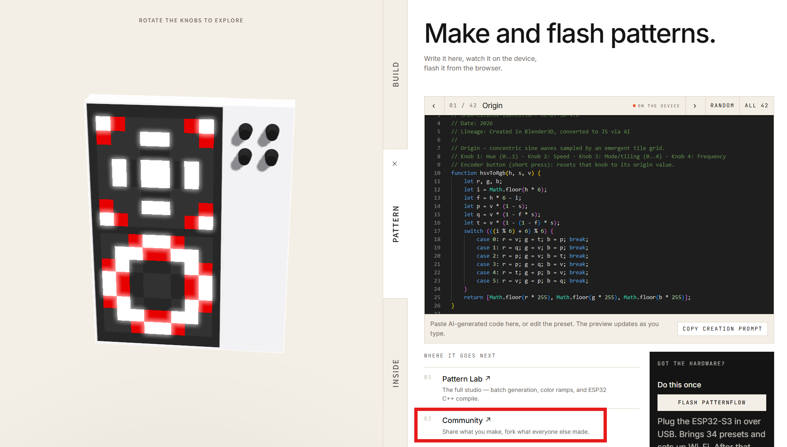

The first thing you see is the wall — and **every pattern on it runs on every
Patternflow.** You can play with all of it without an account.

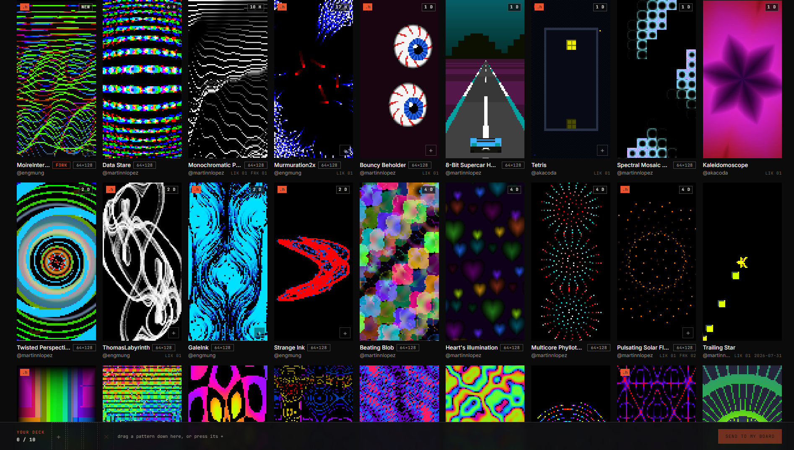

What the wall does:

- **Hover** and the pattern actually plays (the still image is only a preview)
- While it plays, **scroll to turn its knobs** — your cursor's horizontal
  position picks which of K1–K4 you're holding
- **Ctrl + scroll** resizes the cards
- Sorting: Newest · Most liked · Most forked · In decks, plus the **`.h`
  Flashable now** filter — an `.h` badge means the author uploaded a firmware
  header they verified on a real device, so the pattern can go straight onto
  yours

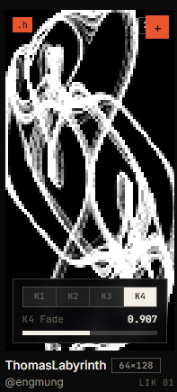

> **Some cards have no `+` (add to deck) button — that's not a bug.** It means
> the author shared the pattern without an `.h` header, so it hasn't been
> verified on hardware yet. Only header-carrying patterns can be sent to a
> device, so only they get the `+`.

Click a pattern and you're on its detail page — the full code, knob sliders,
and a row of buttons. `Open in Pattern Lab` pulls the pattern onto your own
workbench to take apart and remix (a fork). Just note it for now; the next
chapters use all of this.

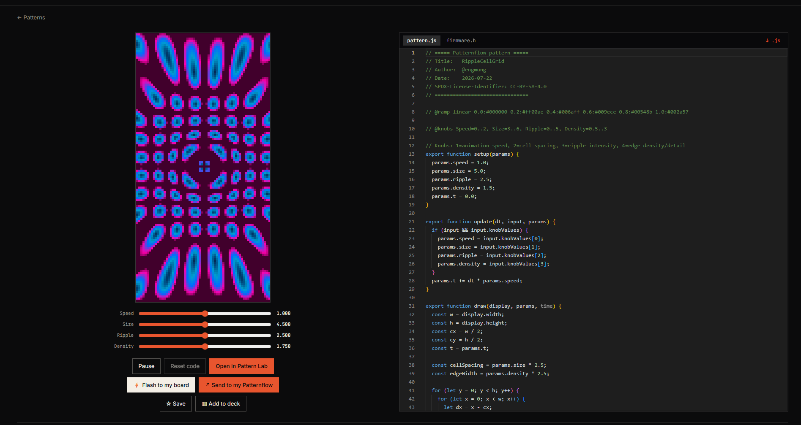

One more thing in the top nav — **Workshop** is where directions get discussed
and decided. It's under heavy construction, so this guide leaves it alone for
now.

---

## 3. Putting someone else's pattern on your device

The fastest route to a first success. Two ways to do it.

### 3-1. A deck of several at once (recommended)

A **deck** is a set of patterns bound for the device. The device cycles
patterns in order, so think of it as a setlist.

1. Press **`+`** on any pattern card you like, or drag the card down into the
   deck bar at the bottom of the screen. Up to 10.
2. Inside the deck, **drag to rearrange**, **×** to remove.

   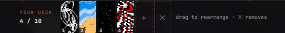

3. Press **`SEND TO MY BOARD`** at the deck's bottom right.

   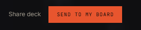

4. The build finishes in seconds — you'll see something like
   `✓ 4 modules · 32 KB`. Press **`SEND OVER WI-FI`**.

   

5. The device's **Patterns page** opens and the modules upload themselves.
   When `done` ticks down the list, that's it — they appear on the device
   immediately.

   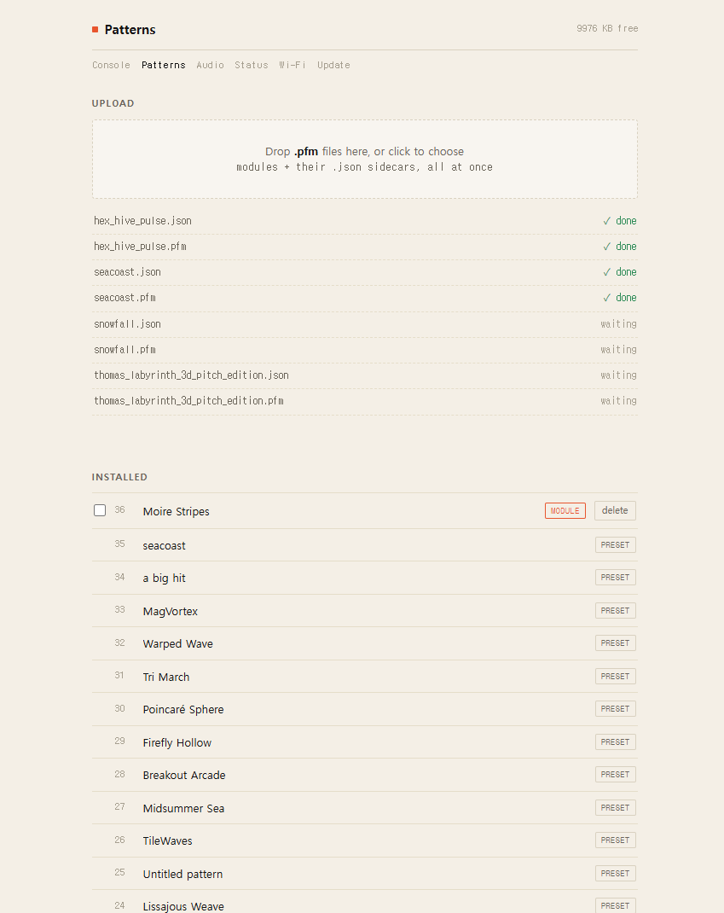

> ⚠️ **When this step fails, it is almost always one thing**: the device is
> off, or on a different network than your computer. Power it on, check it's
> on the same Wi-Fi, and press again.

**Deleting works on the same page**: tick the checkboxes and press
`Delete selected`. The built-in presets (PRESET) can't be deleted — only
modules (MODULE) you uploaded.

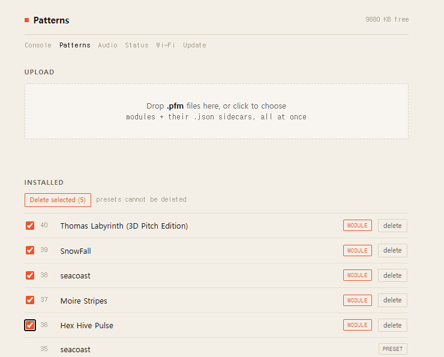

**Decks can be shared, too.** `Share deck` (next to `SEND TO MY BOARD`)
publishes your selection to the community — and under **Decks** in the top
nav you can browse the sets other people have curated and send one straight
to your own device.

### 3-2. One pattern, from its detail page

The two buttons on a pattern's detail page are exactly the two paths from
[chapter 1](#1-one-concept-the-two-ways-a-pattern-reaches-the-device):

- **`Send to my Patternflow`** — a module, done in seconds. **Use this one.**
- **`Flash to my board`** — rebuilds the full firmware and installs it. Slow,
  so save it for when you want the firmware update that comes with it.

---

## 4. Making your own in Pattern Lab

Now for the making side. Click **Pattern Lab ↗** at the community's top right.

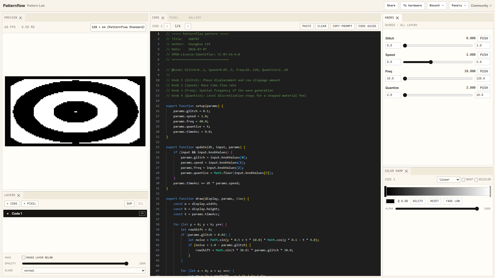

Pattern Lab has a lot of panels, but **this guide uses exactly two things:
pattern generation and the color ramp.** They're enough to take a pattern from
nothing to your device. Layers, pixel art, the gallery — all of that is for a
later guide.

### 4-1. Pick a resolution first

Start with the resolution selector above the Preview panel. A standard
Patternflow is **128 × 64** (landscape) or **64 × 128** (portrait — the
device's usual standing orientation). The choice is recorded in the code as a
single `// @matrix` line and travels with the pattern through sharing,
forking, and firmware conversion.

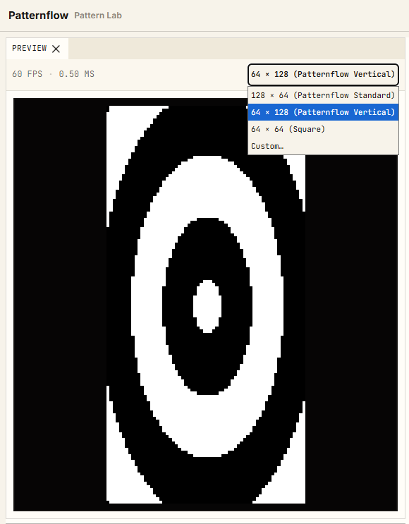

### 4-2. Generating patterns with AI

A pattern is JavaScript code — but you don't have to write it.

1. Press **`COPY PROMPT`** in the CODE panel. It copies a prompt that carries
   every rule of a Patternflow pattern.
2. Paste it into whatever AI you use — ChatGPT, Claude, Gemini — and then
   describe what you want to make.
3. The AI comes back with **five patterns**. Copy them in one at a time with
   **`PASTE`** — the preview updates instantly.
4. Nothing you love? Ask for another five. And another. **Finding a good
   pattern takes real patience** — and how specifically you describe what you
   want, i.e. how well you write the prompt, matters just as much.

Try the sliders in the **Knobs panel** on the right — a well-made pattern
changes character completely across its four knobs. These are the same four
you'll be turning as physical knobs on the device.

**The number boxes flanking each slider are its minimum and maximum.** You can
tune the range a knob travels through, and the ranges you set here are
applied everywhere — in the code that goes to your device *and* in the code
that gets shared. Narrow a knob down to the band where the pattern is actually
interesting, and the physical knob on the device will sweep exactly that band.

> Want to touch the code itself? The `CODE GUIDE` button documents the pattern
> structure (setup / update / draw). This guide doesn't go there.

### 4-3. Coloring with the ramp

Many generated patterns **draw only in brightness (0–1)**. For those, color
comes not from the code but from the **COLOR RAMP panel** — a tool that maps a
color gradient across brightness from 0 to 1.

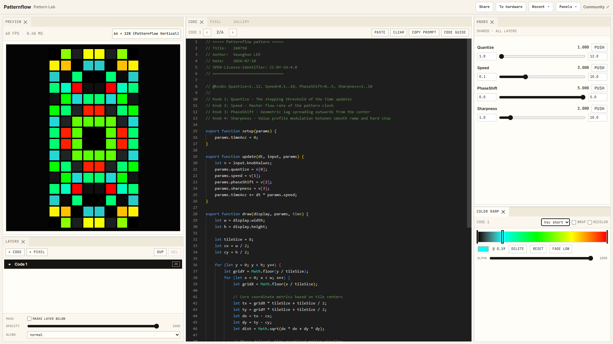

- Click the ramp bar to **add stops**, and pick a color per stop
- The mode (linear / smooth / step / hsv short / hsv long) changes how colors
  blend between stops — the hsv modes travel around the color wheel, rainbow
  style

The same pattern becomes a completely different object with a different ramp.
Play here until the colors feel right — the ramp is recorded in the code as a
`// @ramp` line and ships with the pattern when you share it.

`ALPHA` is for stacking multiple layers. Layers aren't covered in this guide —
but if you're used to Photoshop-style layering you'll get it at a glance, so
feel free to explore.

---

## 5. Verifying on your device

**Do this before you share. Every time.** The reason is simple:

> The device runs C++; patterns are JavaScript. To get onto hardware, an AI
> translates the code into a C++ header (`.h`) — and **that translation
> doesn't always succeed.** A pattern can be perfect in the browser and come
> out different on the device. So before publishing: check it on your own
> device with your own eyes, fix what needs fixing, and share the version
> that's done. That's what lets the next person trust the `.h` badge and
> flash it without thinking.

### 5-1. Convert to an .h header

1. Press **`To hardware`** at the lab's top right.

   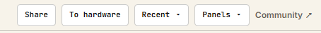

2. The "Convert to a firmware header" dialog opens. Press
   **`COPY THE CONVERSION PROMPT`** and paste it into the same AI you've been
   using.
3. It returns `.h` code starting with `#pragma once`. Copy that into the
   dialog's input and press **`NEXT →`**.

   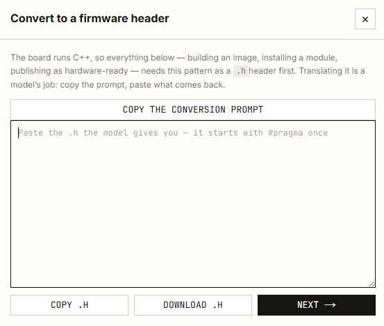

### 5-2. Put it on the device and look

The "On to hardware" screen appears. Your header is ready — and it tells you
to **try it on the board first.**

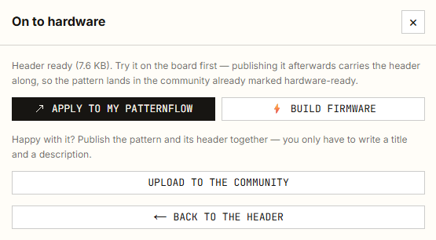

1. Press **`APPLY TO MY PATTERNFLOW`** — it's the module path, so it takes
   seconds. (`BUILD FIRMWARE` is the full bake from
   [chapter 1](#1-one-concept-the-two-ways-a-pattern-reaches-the-device) —
   you don't need it right now.)
2. In the dialog, press **`Send over Wi-Fi`** — with the device on and
   connected, it uploads immediately.

   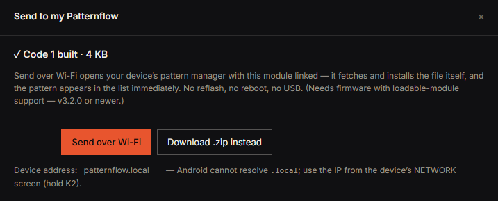

3. **Look at the device.** Does it match the browser preview? Do the knobs
   respond the same way?

If something's off: go `BACK TO THE HEADER` and ask the AI to convert again
(a straight retry often fixes it), or adjust the pattern code and reconvert.
**Repeat until it looks right — then move on.**

---

## 6. Sharing to the community

Once it's verified on your device, press **`UPLOAD TO THE COMMUNITY`** on that
same "On to hardware" screen. Publishing this way **carries your verified
`.h` header along with the pattern**, so it lands on the wall wearing the
`.h` badge — a pattern anyone can flash right now.

(The `Share` button at the lab's top right also publishes, but that path
uploads the JS pattern only, with no `.h`. If you went to the trouble of
making the header, publish from here.)

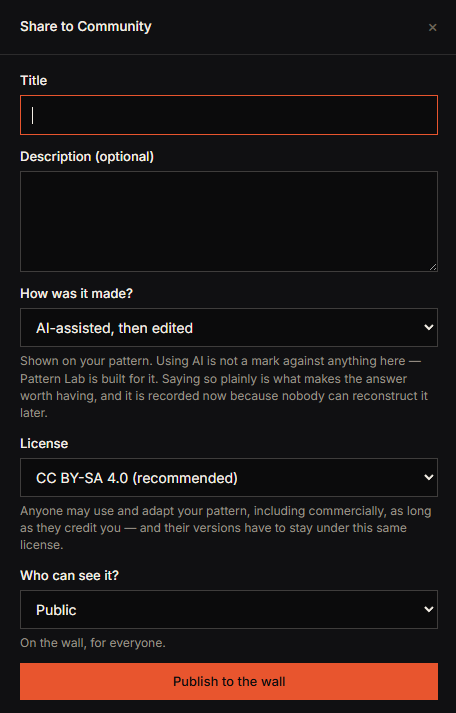

What you fill in:

- **Title / Description** — a name and a short note
- **How was it made?** — generated with AI, hand-edited, and so on. Using AI
  is no mark against anything here — Pattern Lab is built for it. It's
  recorded now simply because nobody can reconstruct the answer later.
- **License** — the default recommendation is **CC BY-SA 4.0**: anyone may use
  and adapt your pattern as long as they credit you and share their versions
  under the same terms.
- **Who can see it?** — Public puts it on the wall.

Press **`Publish to the wall`** and you're done. Your pattern now plays on the
wall; someone hovers it, turns its knobs, forks their own version, decks it
onto their device. The loop has come all the way around.

---

## 7. When something goes wrong

| Symptom | Check |
| --- | --- |
| `Send over Wi-Fi` does nothing, or fails | Device power · **same Wi-Fi network** as the computer · on Android, use the IP from the NETWORK screen (hold K2) instead of `patternflow.local` |
| The device's Patterns page won't open | Same as above — try typing `patternflow.local` into the address bar directly |
| A card has no `+` (add to deck) | Not a bug — the author shared it without an `.h` header (not hardware-verified) |
| The `.h` conversion looks wrong on the device | Ask the AI to convert again (a plain retry often fixes it) · simplify the pattern code · try a different model |
| Modules uploaded but don't appear in the list | Firmware older than v3.2.0 — run one `BUILD FIRMWARE` (full bake) to update |
| `BUILD FIRMWARE` takes forever | It genuinely does — it rebuilds everything, so a minute or more is normal |
| The device is out of storage | The Patterns page shows free space (KB free) at the top right — delete modules you don't use |
| The build button asks you to sign in | Baking modules/firmware happens on a server, so it needs a community account (username + password only — no email asked) |

---

*The rest of Pattern Lab — layer compositing, pixel art, the gallery — gets
its own guide later.*
