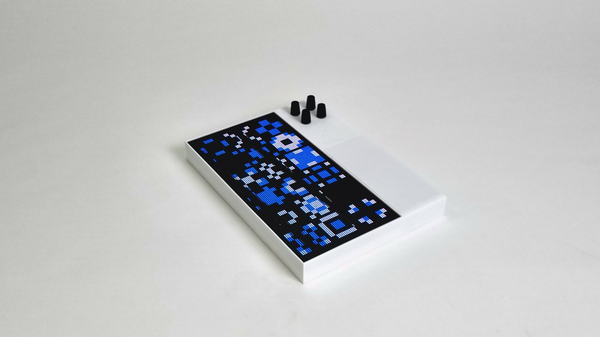

# Patternflow

> ⚠️ **Photosensitivity Warning**
> Patternflow displays rapidly changing light patterns that may trigger seizures in people with photosensitive epilepsy. Viewer discretion is advised. If you experience any discomfort, stop use immediately.

  

## Patternflow is an open-source LED synthesizer played with the fingertips.

Turning four physical knobs reshapes patterns from creative coding on an LED matrix in real time. The light is no longer a visual effect to be watched but a multisensory experience connected directly to the motion of the hand.

  
  

## At its core, this work is about **making things easy and sharing them.**

Audiences do not stop at appreciating a finished piece. Through the publicly released hardware files, firmware, 3D models, web preview, and AI prompts, anyone can build their own Patternflow, generate their own patterns, test them in the browser, and upload them to the device.

## Patternflow returns to Nam June Paik's *Participation TV* in the technological conditions of the present.

Where *Participation TV* showed that the audience could intervene in an electronic image, Patternflow proposes the step that comes after participation. The audience can move from operating the work to making, modifying, and sharing it as creators.

## **Patternflow** is therefore not a single luminous object.

It is a living system in which a physical experience extends outward into open-source making and community creation.

---

Build it from the files, or wait for the kit.

👉 **Ready to build?** Follow the **[Current Full Build Guide (BUILD_GUIDE.md)](BUILD_GUIDE.md)** to assemble your own Patternflow from scratch! You can also explore the modular **[Assembly Map (docs/assembly/README.md)](docs/assembly/README.md)** for alternative enclosure and electronics paths.

> **v2.0.0 is live.** Cold-boot fix, runtime pattern switching, browser flasher, Live Editor, journal, build map, and AI-assisted custom patterns.

## Patterns

The **[Live Editor](https://patternflow.work/pattern)** opens with a preset library of **nearly 30 patterns** — a month of daily pattern-making, each loadable in one click and remixable right in the browser. It's the fastest way to see the range of what the system makes, and every preset is a starting point you can edit, preview, and reflash.

On the device, the firmware bundles a **curated preset library** plus **three reusable custom slots** for your own patterns — all in a single image, switchable without reflashing.

- It boots into **Origin** — concentric sine waves sampled by an emergent grid.
- **Long-press encoder 4** to cycle through the patterns on the device.

New pattern studies go up on [Instagram](https://www.instagram.com/patternflow.work) almost daily, and the [Discord](https://discord.gg/Vr9QtsxeTk) **patterns** channel goes further — it mirrors every post *and* collects the community's own creations, each with full JavaScript source, a hardware-tested C++ header, and the design notes behind it. **Come for a pattern you saw on a post, stay to share your own.**

## Make your own patterns

Patternflow ships with a prompt template designed for AI coding assistants (Claude, ChatGPT, etc.). To make a new pattern:

1. Go to the **Live Editor** in the **Pattern** section on [patternflow.work](https://patternflow.work) and click **Copy creation prompt**.
2. Paste it into your AI assistant (Claude, ChatGPT, etc.) along with a description of the look you want.
3. Copy the generated JavaScript code, paste it into the **Live Editor**, and turn the virtual knobs in the web preview to test the pattern.
4. Once you are happy with the visuals, click **Copy C++ prompt** in the editor and send it to your AI assistant.
5. Save the C++ output into a **custom slot** — overwrite `custom1.h` (or `custom2.h` / `custom3.h`) in `firmware/patternflow/`, keeping its `namespace CustomN` and updating `NAME`. To add more slots, see [`firmware/patternflow/README.md`](firmware/patternflow/README.md).
6. Open `firmware/patternflow/patternflow.ino` in the Arduino IDE and upload your custom build.

No GLSL or rendering pipeline knowledge needed. The template handles the encoder mapping, brightness curve, and HUB75 buffer interface; you describe the visuals.

Custom patterns require a local Arduino IDE compile/upload step for now.

## Audio-react control

Patternflow can react to browser audio over Wi-Fi. The recommended workflow is the experimental Chrome/Edge extension in [`tools/patternflow-audio-extension`](tools/patternflow-audio-extension): it captures the current tab's audio, analyzes four FFT bands, and sends lightweight WebSocket knob values to the device. The firmware converts those values into virtual encoder motion, so every encoder-driven pattern can respond without adding audio code to each pattern.

The device still serves a built-in page at `http://patternflow.local/` when Wi-Fi is configured. Keep it around for file playback, microphone input, and local experiments; browser tab/system audio capture is more reliable through the extension because normal `http://patternflow.local` pages are limited by browser capture permissions.

## Links

- [patternflow.work](https://patternflow.work) — browser flasher, Live Editor, journal, build map
- [Releases](../../releases) — stable bundles
- [Discord](https://discord.gg/Vr9QtsxeTk) — questions, builds, custom patterns
- [Audio Extension](tools/patternflow-audio-extension) — experimental Chrome/Edge tab-audio controller

## How it's built

Patternflow is built around a standalone ESP32-S3 driving a HUB75 RGB LED matrix at low resolution — each pixel reads as a discrete point of light, with its own brightness and color. Four rotary encoders feed firmware written in Arduino-compatible C++ around a modular pattern architecture: each pattern is a self-contained module with its own setup, update, and draw routines, while the shared framework handles input, LED rendering, mode transitions, and color calibration. The PCB was designed by the artist; the enclosure is 3D-printed by default, with stainless steel, transparent acrylic, and laser-cut variations in progress.

## Repository structure

- `firmware/` — Arduino code for ESP32-S3, plus the custom pattern template
- `hardware/` — enclosure files and electronics source files (case, PCB, Gerbers, schematic PDF)
- `web/` — Next.js site (landing, browser flasher, Live Editor, journal)
- `docs/` — build paths, build guide, media, license summary
- `tools/` — desktop-side helpers, including the experimental audio-react browser extension

## Documentation

- [Assembly Map](docs/assembly/README.md)
- [Current Full Build Guide](BUILD_GUIDE.md)
- [Custom Patterns](firmware/CUSTOM_PATTERNS.md)
- [Contributing](CONTRIBUTING.md)
- [Changelog](CHANGELOG.md)
- [License Summary](docs/LICENSE-SUMMARY.md)

## Contributing

Guidelines for contributing to the repository are currently under preparation. In the meantime, please refer to the [`CONTRIBUTING.md`](CONTRIBUTING.md) file for more information.

## Timeline

| When | Milestone |
| :--- | :--- |
| **Jan 2026** | Built Patternflow *Origin*, the first pattern · visited the Nam June Paik Art Center |
| **Mar 2026** | First experiments with LEDs and potentiometers |
| **Apr 2026** | First prototype · strong response on Reddit and Instagram — the community asked for the files, not a product, so Patternflow went open source · first PCB fabricated *(sponsored by PCBWay)* · website live |
| **May 2026** | Continuous pattern development · Crowd Supply agreement · Discord community growing · a Paris-based creative technologist joins as the first collaborator |
| **Jun 2026** | First community-made pattern shared · 3D-printed enclosure in production *(sponsored by PCBWay)* |
| **Next** | Contribution guide & issue cleanup · Crowd Supply campaign · growing a sustainable business · wider outreach · continued development |

📖 Longer write-ups and the full story behind each step live on the **[journal](https://patternflow.work/journal)**.

### Sponsor

Patternflow's PCB fabrication and 3D-printed enclosure are sponsored by **[PCBWay](https://www.pcbway.com/)**. The first PCB came back clean and on-spec, ordering was straightforward, and the team has been genuinely responsive throughout — the support that made these milestones possible. The 3D-printed enclosure parts are in production now; this section will be updated with photos once they arrive.

<i>The first Patternflow PCB, fabricated by PCBWay.</i>

## License

- Firmware & web — **MIT** ([LICENSE-MIT](./LICENSE-MIT))
- Hardware & designs — **CC-BY-SA 4.0** ([LICENSE-CC-BY-SA](./LICENSE-CC-BY-SA))
- Patterns — **CC-BY-SA 4.0**. Community submissions are inbound = outbound: by sharing a pattern you license it under CC-BY-SA 4.0 with attribution kept in the code header (no CLA). See [CONTRIBUTING.md](CONTRIBUTING.md).

"Patternflow" is a trademark of SeungHun Lee.

The Patternflow series: LED Synthesizer (2026) · Origin (2026)
