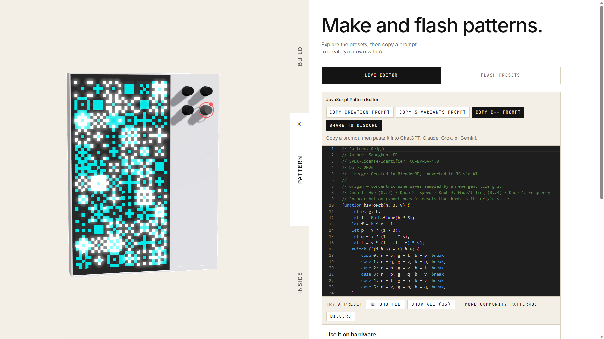
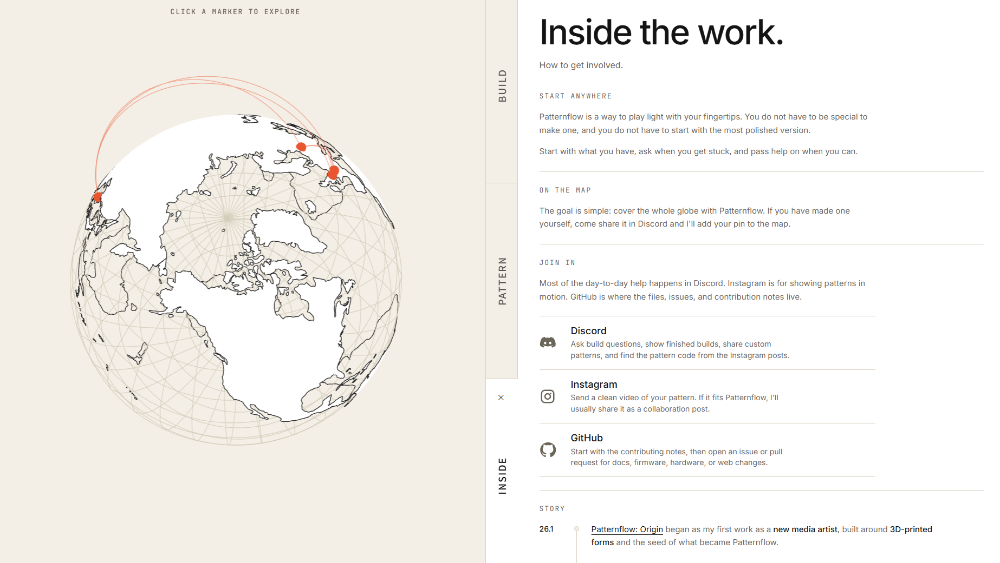

# Patternflow

> ⚠️ **Photosensitivity Warning**
> Patternflow displays rapidly changing light patterns that may trigger seizures in people with photosensitive epilepsy. Viewer discretion is advised. If you experience any discomfort, stop use immediately.

  

  <a href="https://youtu.be/OXt-yg_7qdk"><b>▶ Watch the demo on YouTube</b></a>

**Patternflow is an open-source LED synthesizer played with the fingertips.** Turning four physical knobs reshapes generative light patterns on an LED matrix in real time — a contemporary reinterpretation of Nam June Paik's *Participation TV* (1963). Paik invited audiences to experience art; Patternflow invites you to create it.

### Three ways in

- 🔨 **Build it** — follow the **[Full Build Guide](BUILD_GUIDE.md)** (official PCB + 3D-printed enclosure), or go solder-free with the **[Breadboard Build Guide](https://patternflow.work/build/breadboard)** — no PCB, no soldering iron, same Patternflow. More paths in the **[Assembly Map](docs/assembly/README.md)**.
- 📦 **Get one ready-made** — Patternflow is in **[pre-launch on Crowd Supply](https://www.crowdsupply.com/engmung/patternflow)**. Subscribe to be notified the moment the campaign goes live.
- 🎛️ **Try it right now** — the **[Live Editor](https://patternflow.work/pattern)** runs a virtual Patternflow in your browser. Same knobs, same patterns, no hardware.

> **Moving fast.** The repo improves almost daily and release tags lag behind — v2.0.0 brought the cold-boot fix, runtime pattern switching, the browser flasher, and the Live Editor, and work since then includes an SMD-free PCB revision. Follow the [changelog](CHANGELOG.md) and the [journal](https://patternflow.work/journal) for what's current.

## Quick facts

| | |
| :--- | :--- |
| **Display** | 128 × 64 HUB75 RGB LED matrix, P2.5 (320 × 160 mm) |
| **Brain** | ESP32-S3-WROOM-1 **N16R8** (16 MB flash, 8 MB PSRAM) — standalone, no sending card |
| **Input** | 4× EC11 rotary encoders with push-switch; long-press encoder 4 to switch patterns |
| **Power** | 5 V over USB from a standard power bank |
| **Size / weight** | 245 × 325 × 36 mm (9.6 × 12.8 × 1.4 in) · 933 g (2.06 lb) |
| **Firmware** | Arduino-compatible C++, modular pattern architecture, runtime switching (no reflash) |
| **Flashing** | Stock firmware from the browser (Chrome/Edge), no IDE needed; custom patterns via Arduino IDE |
| **Connectivity** | Wi-Fi — bidirectional OSC (Ableton/Max/TouchDesigner) and audio-react WebSocket · USB |
| **Build** | 4–6 h active work + ~11 h 3D printing · intermediate skill · around US$80 in parts ([BOM](BUILD_GUIDE.md#1-bill-of-materials-bom)) |
| **License** | MIT (firmware & web) · CC-BY-SA 4.0 (hardware & patterns) |

## Patterns

The **[Live Editor](https://patternflow.work/pattern)** opens with a preset library of **nearly 30 patterns** — a month of daily pattern-making, each loadable in one click and remixable right in the browser. The stock firmware, presets included, flashes to the device straight from the browser; your own remixes go into a custom slot (see below).

On the device, the firmware bundles a **curated preset library** plus **three reusable custom slots** for your own patterns — all in a single image, switchable without reflashing.

- It boots into **Origin** — concentric sine waves sampled by an emergent grid.
- **Long-press encoder 4** to cycle through the patterns on the device.

New pattern studies go up on [Instagram](https://www.instagram.com/patternflow.work) almost daily, and the [Discord](https://discord.gg/Vr9QtsxeTk) **patterns** channel goes further — it mirrors every post *and* collects the community's own creations, each with full JavaScript source, a hardware-tested C++ header, and the design notes behind it. **Come for a pattern you saw on a post, stay to share your own.**

## Make your own patterns

Patternflow ships with a prompt template designed for AI coding assistants (Claude, ChatGPT, etc.). To make a new pattern:

1. Go to the **Live Editor** in the **Pattern** section on [patternflow.work](https://patternflow.work) and click **Copy creation prompt**.
2. Paste it into your AI assistant (Claude, ChatGPT, etc.) along with a description of the look you want.
3. Copy the generated JavaScript code, paste it into the **Live Editor**, and turn the virtual knobs in the web preview to test the pattern.
4. Once you are happy with the visuals, click **Copy C++ prompt** in the editor and send it to your AI assistant.
5. Open `firmware/patternflow/patternflow.ino` in the Arduino IDE — the custom slots and the registry open right alongside it as editor tabs, so everything happens in one window.
6. In the `custom1.h` (or `custom2.h` / `custom3.h`) tab, paste the C++ output **as-is**. Grab the pattern's namespace name from the bottom of the file (`} // namespace YourPatternName`), paste it into that slot's `PATTERN_ENTRY(...)` line in the `pattern_registry.h` tab, and hit flash. To add more slots, see [`firmware/patternflow/README.md`](firmware/patternflow/README.md).

No GLSL or rendering pipeline knowledge needed. The template handles the encoder mapping, brightness curve, and HUB75 buffer interface; you describe the visuals.

Custom patterns require a local Arduino IDE compile/upload step for now.

## The website

[patternflow.work](https://patternflow.work) is not a companion page — it's half the instrument. Everything below runs in the browser, no account, no install.

  
  

**[Live Editor](https://patternflow.work/pattern)** — a full Patternflow simulator. You don't need the hardware to start: turn the virtual knobs and the on-screen device behaves exactly like the real one, down to the encoder detents. Browse the presets, copy the AI prompts, test your pattern live, and flash the stock firmware over USB — all from the same page.

**[Build map](https://patternflow.work/inside)** — a globe of Patternflows built around the world, and the goal is simple: cover it with pins. If you've made one — any material, any variation — share it in Discord and your build gets added to the map.

**[Journal](https://patternflow.work/journal)** — Patternflow is treated as art, so the whole process is documented transparently: the events, the emotions, and the thinking behind every step, written up at least once a week since the beginning. If you want to know why this project exists — and what it costs to keep it alive — start there.

## OSC & audio-react

**Bidirectional OSC.** Over Wi-Fi, Patternflow speaks OSC in both directions: knob turns, button presses, and pattern switches stream out to a remote host (Ableton Live, Max/MSP, TouchDesigner — anything that speaks OSC), and incoming OSC messages drive the device exactly like physical encoder motion. Play Patternflow as a controller for your set, let your set drive the light, or both at once. If you play MIDI instruments, this will feel like home.

**Audio-react.** Patternflow can also react to browser audio: the experimental Chrome/Edge extension in [`tools/patternflow-audio-extension`](tools/patternflow-audio-extension) captures the current tab's audio, analyzes four FFT bands, and sends lightweight WebSocket knob values to the device. The firmware converts those into virtual encoder motion, so every encoder-driven pattern responds — no audio code needed in the patterns themselves.

## How it's built

Patternflow is built around a standalone ESP32-S3 driving a HUB75 RGB LED matrix at low resolution — each pixel reads as a discrete point of light, with its own brightness and color. Four rotary encoders feed firmware written in Arduino-compatible C++ around a modular pattern architecture: each pattern is a self-contained module with its own setup, update, and draw routines, while the shared framework handles input, LED rendering, mode transitions, and color calibration. The PCB was designed by the artist; the enclosure is 3D-printed by default, with stainless steel, transparent acrylic, and laser-cut variations in progress.

## The idea

At its core, this work is about **making things easy and sharing them.** Interactive media art has a gatekeeping problem — installations can require serious capital, custom engineering, and years of specialized skill. Patternflow flips that: through the publicly released hardware files, firmware, 3D models, web preview, and AI prompts, anyone can build their own Patternflow, generate their own patterns, test them in the browser, and upload them to the device.

Where Nam June Paik's *Participation TV* showed that the audience could intervene in an electronic image, Patternflow proposes the step that comes after participation: the audience moves from operating the work to making, modifying, and sharing it as creators.

Patternflow is therefore not a single luminous object. It is a living system in which a physical experience extends outward into open-source making and community creation. The longer version lives in the [manifesto](docs/manifesto.md) and the [journal](https://patternflow.work/journal).

## Repository & documentation

| Folder | Contents |
| :--- | :--- |
| `firmware/` | Arduino code for ESP32-S3, plus the custom pattern template |
| `hardware/` | Enclosure files and electronics source files (case, PCB, Gerbers, schematic PDF) |
| `web/` | Next.js site (landing, browser flasher, Live Editor, journal) |
| `docs/` | Assembly map, build-guide media, manifesto, license summary |
| `tools/` | Desktop-side helpers, including the audio-react browser extension |

**Docs:** [Full Build Guide](BUILD_GUIDE.md) · [Assembly Map](docs/assembly/README.md) · [Custom Patterns](firmware/CUSTOM_PATTERNS.md) · [Changelog](CHANGELOG.md) · [License Summary](docs/LICENSE-SUMMARY.md)

**Links:** [patternflow.work](https://patternflow.work) · [Crowd Supply](https://www.crowdsupply.com/engmung/patternflow) · [Releases](../../releases) · [Discord](https://discord.gg/Vr9QtsxeTk) · [Instagram](https://www.instagram.com/patternflow.work)

## Contributing

Builds, documentation fixes, part sourcing tips, and custom patterns are all welcome — see [CONTRIBUTING.md](CONTRIBUTING.md) for how contributions flow (including the inbound = outbound pattern licensing). The [Discord](https://discord.gg/Vr9QtsxeTk) is the fastest place to ask questions, show a build in progress, or share a pattern — and to get your build pinned on the [build map](https://patternflow.work/inside).

## Story so far

| When | Milestone |
| :--- | :--- |
| **Jan 2026** | *Patternflow: Origin* — the first work as a new media artist, built around 3D-printed forms and the seed of what became Patternflow · visited the Nam June Paik Art Center |
| **Mar 2026** | The Origin pattern ran on a physical LED matrix with four knobs for the first time |
| **Apr 2026** | Instagram and the Arduino subreddit responded strongly — **150,000+ views and 3,700 upvotes** — and the community asked for the files, not a product, so Patternflow went open source · first PCB fabricated *(sponsored by PCBWay)* · website live |
| **May 2026** | Reached **100 GitHub stars** · the first collaborator joined · Crowd Supply agreement · Discord community growing |
| **Jun 2026** | [Crowd Supply pre-launch page](https://www.crowdsupply.com/engmung/patternflow) live, backed by countless refinements toward mass production · Instagram passed **1,000 followers** · first community-made pattern shared |
| **Jul 2026** | Refining the design for mass production · growing an active community · outreach and promotion |
| **Next** | Run the Crowd Supply campaign at the lowest sustainable price · send Patternflow further out into the world · collaborate with more artists · earn academic recognition |
| **2028** | Grow Patternflow into a self-sustaining community and ecosystem — then move on to the next project |

📖 Longer write-ups and the full story behind each step live on the **[journal](https://patternflow.work/journal)**.

### Sponsor

Patternflow's PCB fabrication and 3D-printed enclosure are sponsored by **[PCBWay](https://www.pcbway.com/)**. The first PCB came back clean and on-spec, ordering was straightforward, and the team has been genuinely responsive throughout — the support that made these milestones possible.

<i>The first Patternflow PCB, fabricated by PCBWay.</i>

## License

- Firmware & web — **MIT** ([LICENSE-MIT](./LICENSE-MIT))
- Hardware & designs — **CC-BY-SA 4.0** ([LICENSE-CC-BY-SA](./LICENSE-CC-BY-SA))
- Patterns — **CC-BY-SA 4.0**. Community submissions are inbound = outbound: by sharing a pattern you license it under CC-BY-SA 4.0 with attribution kept in the code header (no CLA). See [CONTRIBUTING.md](CONTRIBUTING.md).

"Patternflow" is a trademark of SeungHun Lee.

The Patternflow series: LED Synthesizer (2026) · Origin (2026)
