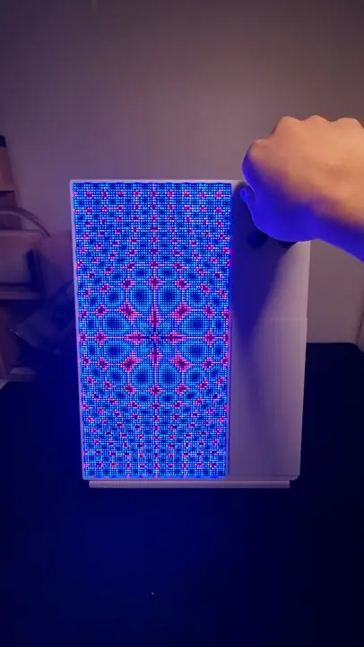
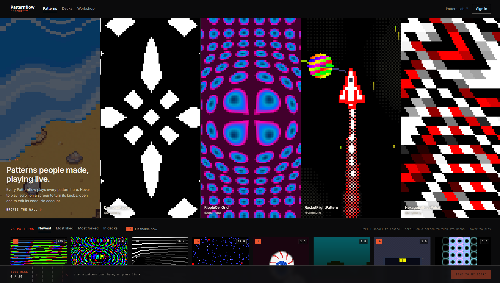
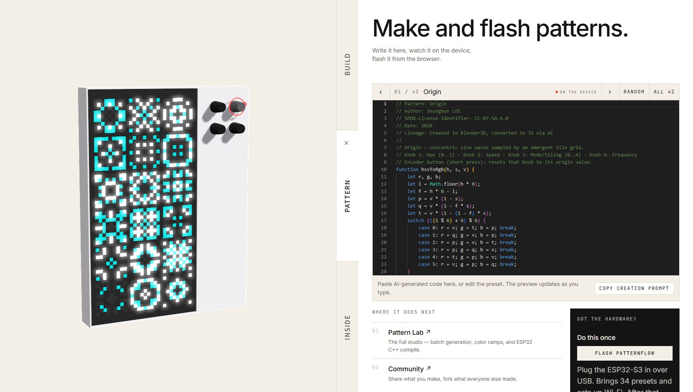
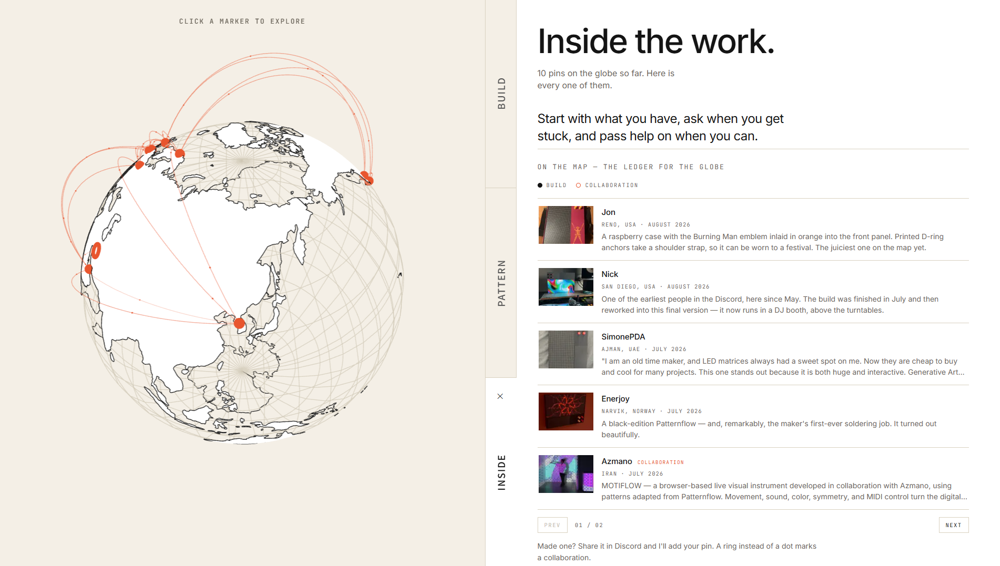

# Patternflow

> ⚠️ **Photosensitivity Warning**
> Patternflow displays rapidly changing light patterns that may trigger seizures in people with photosensitive epilepsy. Viewer discretion is advised. If you experience any discomfort, stop use immediately.

  

  <a href="https://www.instagram.com/p/DbD2z1VSG09/">▶ the full reel on Instagram</a>

  

  <a href="https://youtu.be/BPMhTChY9vg"><b>▶ Watch the demo on YouTube</b></a>

**Patternflow is an open-source LED synthesizer.** Play light patterns with your fingertips — four physical knobs reshape generative light on an LED matrix in real time. A pattern is just a small file, so **every Patternflow plays every pattern we make.**

### Four ways in

- 🔨 **Build it** — the **[Full Build Guide](BUILD_GUIDE.md)** (official PCB + 3D-printed enclosure), or solder-free with the **[Breadboard Build Guide](https://patternflow.work/build/breadboard)**. Every other route is in the **[Assembly Map](docs/assembly/README.md)**. **Never soldered before? You'll be fine** — it's all big through-hole joints, every first-timer who has built one finished it without trouble, and most of them came back saying the soldering was the fun part. One build on the map was its maker's first-ever soldering job.
- 📦 **Get one ready-made** — the **[Crowd Supply campaign](https://www.crowdsupply.com/engmung/patternflow)** launches **Q4 2026**. Subscribe on the page and you'll hear the moment it opens.
- 🎛️ **Try it right now** — the **[Live Editor](https://patternflow.work/pattern)** is a working Patternflow in your browser. No hardware, no install, no account.
- 🌀 **Share what you make** — the **[Community](https://community.patternflow.work/community)** is where patterns get published, remixed and forked. The **[Pattern Guide](PATTERN_GUIDE.md)** walks the whole loop: make a pattern, verify it on your device, share it back.

> **Moving fast.** [**v3.2.0 is out**](https://github.com/engmung/Patternflow/releases/tag/v3.2.0) — patterns now install over Wi-Fi as `.pfm` modules, no reflash. The v3 generation also brought hybrid USB-C / screw-terminal power, zero SMD passives, a snap-fit enclosure, and a [video-first build guide](BUILD_GUIDE.md). On v2.x hardware? Everything you need stays bundled at [v2.1.0](https://github.com/engmung/Patternflow/releases/tag/v2.1.0). Follow the [changelog](CHANGELOG.md) and the [journal](https://patternflow.work/journal) for what's current.

## Quick facts

| | |
| :--- | :--- |
| **Display** | 128 × 64 HUB75 RGB LED matrix, P2.5 (320 × 160 mm) |
| **Brain** | ESP32-S3-WROOM-1 **N16R8** (16 MB flash, 8 MB PSRAM) — standalone, no sending card |
| **Input** | 4× EC11 rotary encoders with push-switch; long-press encoder 4 to switch patterns |
| **Power** | 5 V over USB from any power bank — about **4 h per 10,000 mAh** at max brightness (see [runtime](#power--runtime)) |
| **Size / weight** | 245 × 325 × 36 mm (9.6 × 12.8 × 1.4 in) · 933 g (2.06 lb) |
| **Firmware** | Arduino-compatible C++, modular pattern architecture, runtime switching (no reflash) |
| **Flashing** | Everything from the browser — one USB flash the first time, then it's all Wi-Fi: patterns install as modules in seconds, full firmware builds land wirelessly too. Arduino IDE only for firmware development or other matrix resolutions |
| **Connectivity** | Wi-Fi — bidirectional OSC (Ableton/Max/TouchDesigner) and audio-react WebSocket · USB |
| **Build** | ~1 h hands-on (≈30 min soldering + ≈30 min assembly — first-build friendly) + ~10 h 3D printing · US$100–200 in parts ([BOM](BUILD_GUIDE.md#1-bill-of-materials-bom)) |
| **License** | MIT (firmware & web code) · CC-BY-SA 4.0 (hardware, docs, bundled patterns) · community patterns are licensed by their authors ([summary](docs/LICENSE-SUMMARY.md)) |

### Power & runtime

Patternflow runs off any standard USB power bank that can supply a couple of amps at 5 V — no wall adapter needed, so it stays portable. Rule of thumb: **about 4 hours per 10,000 mAh at maximum brightness**, and most patterns draw less.

Measured runtimes

In testing, a 40,000 mAh bank dropped about 13% over 2 hours at **full brightness**, which is roughly **15 hours on a full charge**:

| Power bank | Approx. runtime (max brightness) |
| :--- | :--- |
| 10,000 mAh | ~4 hours |
| 20,000 mAh | ~8 hours |
| 40,000 mAh | ~15 hours |

These are worst-case numbers measured with a bright pattern at maximum brightness. Lowering the brightness (long-press encoder 1) extends runtime well beyond these figures.

## Patterns

The **[Live Editor](https://patternflow.work/pattern)** opens with a preset library of **42 patterns** — months of daily pattern-making, each loadable in one click and remixable right in the browser. The stock firmware, presets included, flashes to the device straight from the browser; your own remixes travel through Pattern Lab and land on the device as Wi-Fi modules (see below).

On the device, the firmware bundles **34 curated presets** in a single image, switchable without reflashing — and your own patterns install alongside them as **`.pfm` modules over Wi-Fi**, up to 128 of them, no reflash needed. The device carries fewer presets than the browser because the on-board set is a curated showcase, not the whole library; anything left out is one Pattern Lab build away.

- It boots into **Origin** — concentric sine waves sampled by an emergent grid.
- **Long-press encoder 4** to cycle through the patterns on the device.

## Community

  

The **[Community](https://community.patternflow.work/community)** is where patterns live — and the wall plays them **live**. Hover a card and the pattern runs; scroll on it and its knobs turn, the same four knobs as the hardware. Open one to read its code, take it into Pattern Lab to remix, and publish it back — the fork is recorded, so you can always see what grew out of what. All of this works without an account.

**From the wall to your device in seconds.** Collect patterns into a **deck** — a setlist of up to ten — and `SEND TO MY BOARD` builds them into Wi-Fi modules and installs them with no cable, no reflash. Decks can be shared too: browse the sets other people curated and send one straight to your own device. Patterns carrying a hardware-verified `.h` header are badged, with a filter for when you want something to flash right now. The **[Pattern Guide](PATTERN_GUIDE.md)** walks every step.

**The Workshop is where the project's future is worked out — in the open.** It's a map of directions Patternflow could take — a wired OSC version, laser-cut enclosures, bigger panels — and anyone can pin themselves to a direction, say what they're working on, and start a thread. Not a roadmap handed down; a map people stand on. It's young and evolving fast, and it matters more than its size suggests: it's how this project decides where to go next.

Signing in is username and password only — no email — so it never routes through a service that might be blocked where you are.

New pattern studies also go up on [Instagram](https://www.instagram.com/patternflow.work) almost daily, and the [Discord](https://discord.gg/Vr9QtsxeTk) **patterns** channel remains a good place to hang around and talk about them. **Come for a pattern you saw on a post, stay to share your own.**

## Make your own patterns

Patternflow ships with prompt templates designed for AI coding assistants (Claude, ChatGPT, Gemini, etc.), and the whole journey from idea to hardware runs in the browser — no toolchain. The **Live Editor** is where you start, **Pattern Lab** is where a pattern becomes firmware, and the **[Community](https://community.patternflow.work/community)** is where it goes when it's done.

  

**Start in the [Live Editor](https://patternflow.work/pattern)** — a full Patternflow simulator, and the quick taste. Turn the virtual knobs and the on-screen device behaves exactly like the real one, down to the encoder detents. You don't need the hardware to begin:

1. Click **Copy creation prompt** and paste it into your AI assistant along with a description of the look you want.
2. Paste the JavaScript it returns into the editor and turn the virtual knobs to test the pattern live.

The Live Editor is where you find out you want to make patterns. It stays deliberately light — the stock firmware flashes straight from it, and everything below is where the making happens.

**Go deeper in [Pattern Lab](https://patternflow.work/pattern-lab)** — the full studio, and where patterns reach the hardware:

- Generate variations **in batches**, in-app (bring your own free Gemini key) or via copy-paste prompts.
- Shape **color ramps**, retune knob ranges, and compose for **custom matrix sizes** — the ranges you set ride along into the device and the shared code.
- **Send to your device in seconds** — a pattern builds into a small `.pfm` module on the server and installs **over Wi-Fi**: no cable, no reflash, no IDE. The full-firmware path is still there for when you want a firmware update to come along with it (about a minute, and it's how the device stays current).
- **Verify, then share** — try the pattern on your own device first, then publish it with its hardware header attached. It lands on the wall wearing the `.h` badge, and the next person can flash it without thinking. The **[Pattern Guide](PATTERN_GUIDE.md)** covers the whole flow.

**From the Arduino IDE** — only needed for firmware feature development or targeting an LED matrix with a different resolution. Open `firmware/patternflow/patternflow.ino`, drop the C++ into `presets/preset_<name>.h` **as-is**, add the namespace from the bottom of the file to `presetPatterns[]` in `pattern_registry.h`, and flash. (For just adding a pattern you don't need this at all — build it as a `.pfm` module and send it over Wi-Fi.) See [`firmware/patternflow/README.md`](firmware/patternflow/README.md).

No GLSL or rendering pipeline knowledge needed. The template handles the encoder mapping, brightness curve, and HUB75 buffer interface; you describe the visuals.

Both full-firmware paths — Pattern Lab's build and the Arduino IDE — flash a whole image, and the preset library always comes along. Patterns installed as `.pfm` modules sit on a separate partition and survive any reflash.

## The website

[patternflow.work](https://patternflow.work) is not a companion page — it's half the instrument. The tools above live there. So do the two records that show the project working in the open.

  

**[Build map](https://patternflow.work/inside)** — a globe of Patternflows built around the world, each pin carrying its build's story, and the goal is simple: cover it with pins. The build map is also what *we* means in "every pattern we make": every pin is a person who built one from these files, in their own material, wherever they are. If you've made one, share it in Discord and it goes on the map.

**[Journal](https://patternflow.work/journal)** — Patternflow is treated as art, so the whole process is documented transparently: the events, the emotions, and the thinking behind every step, written up at least once a week since the beginning. Including the parts that went badly. If you want to know why this project exists — and what it costs to keep it alive — start there.

## OSC & audio-react

**Bidirectional OSC.** Over Wi-Fi, Patternflow speaks OSC in both directions: knob turns, button presses, and pattern switches stream out to a remote host (Ableton Live, Max/MSP, TouchDesigner — anything that speaks OSC), and incoming OSC messages drive the device exactly like physical encoder motion. Play Patternflow as a controller for your set, let your set drive the light, or both at once. If you play MIDI instruments, this will feel like home. For Ableton Live Suite there's a ready-made Max for Live bridge in [`integrations/ableton`](integrations/ableton) — click Connect, map the four knobs to any Live parameters, done. The wire protocol is documented in [`docs/osc-spec.md`](docs/osc-spec.md).

**Audio-react.** Patternflow can also react to browser audio: the experimental Chrome/Edge extension in [`tools/patternflow-audio-extension`](tools/patternflow-audio-extension) captures the current tab's audio, analyzes four FFT bands, and sends lightweight WebSocket knob values to the device. The firmware converts those into virtual encoder motion, so every encoder-driven pattern responds — no audio code needed in the patterns themselves.

## How it's built

Patternflow is built around a standalone ESP32-S3 driving a HUB75 RGB LED matrix at low resolution — each pixel reads as a discrete point of light, with its own brightness and color. Four rotary encoders feed firmware written in Arduino-compatible C++ around a modular pattern architecture: each pattern is a self-contained module with its own setup, update, and draw routines, while the shared framework handles input, LED rendering, mode transitions, and color calibration. The PCB was designed by the artist; the enclosure is 3D-printed by default, with stainless steel, transparent acrylic, and laser-cut variations in progress.

## The idea

**Make it easy. Make it fun. Make it yours.** Interactive media art usually demands serious capital, custom engineering, and years of specialized skill — an entry fee paid long before anyone gets to participate in anything. Patternflow removes it: the hardware files, firmware, 3D models, browser editor, and AI prompts are all public, so anyone can build their own, make their own patterns, test them in the browser, and load them onto the device.

This is a contemporary reinterpretation of Nam June Paik's *Participation TV* (1963). Paik let the audience change the image; Patternflow lets you make it — and give it away. That is the step after participation: from intervening in a work to making, modifying, and sharing it.

So Patternflow is not a single luminous object. It is a living system in which a physical experience extends outward into open-source making and community creation. **We're not making art easier to watch. We're making it easier to make.** The longer version lives in the [manifesto](docs/manifesto.md) and the [journal](https://patternflow.work/journal).

## Repository & documentation

| Folder | Contents |
| :--- | :--- |
| `firmware/` | Arduino code for ESP32-S3, plus the custom pattern template |
| `hardware/` | Enclosure files and electronics source files (case, PCB, Gerbers, schematic PDF) |
| `web/` | Next.js site (landing, Live Editor, Pattern Lab, community, browser flasher & build server, journal) |
| `docs/` | Assembly map, build-guide media, manifesto, license summary |
| `tools/` | Desktop-side helpers, including the audio-react browser extension |
| `integrations/` | Host-software bridges — Ableton Live / Max for Live (OSC knob mapping) |

**Docs:** [Full Build Guide](BUILD_GUIDE.md) · [Pattern Guide](PATTERN_GUIDE.md) · [Assembly Map](docs/assembly/README.md) · [Custom Patterns](firmware/CUSTOM_PATTERNS.md) · [Changelog](CHANGELOG.md) · [License Summary](docs/LICENSE-SUMMARY.md)

**Links:** [patternflow.work](https://patternflow.work) · [Community](https://community.patternflow.work/community) · [Crowd Supply](https://www.crowdsupply.com/engmung/patternflow) · [Releases](../../releases) · [Discord](https://discord.gg/Vr9QtsxeTk) · [Instagram](https://www.instagram.com/patternflow.work)

## Contributing

Builds, documentation fixes, part sourcing tips, and custom patterns are all welcome — see [CONTRIBUTING.md](CONTRIBUTING.md) for how contributions flow (including the inbound = outbound pattern licensing).

Patterns go to the **[Community](https://community.patternflow.work/community)**, builds and questions to **[Discussions](../../discussions)** or the **[Discord](https://discord.gg/Vr9QtsxeTk)** — whichever you can reach. Show a build in Discussions or Discord to get it pinned on the [build map](https://patternflow.work/inside).

## Story so far

| When | Milestone |
| :--- | :--- |
| **Jan 2026** | *Patternflow: Origin* — the first work as a new media artist, built around 3D-printed forms and the seed of what became Patternflow · visited the Nam June Paik Art Center |
| **Mar 2026** | The Origin pattern ran on a physical LED matrix with four knobs for the first time |
| **Apr 2026** | Instagram and the Arduino subreddit responded strongly — **150,000+ views and 3,700 upvotes** — and the community asked for the files, not a product, so Patternflow went open source · first PCB fabricated *(sponsored by PCBWay)* · website live |
| **May 2026** | Reached **100 GitHub stars** · the first collaborator joined · Crowd Supply agreement · Discord community growing |
| **Jun 2026** | [Crowd Supply pre-launch page](https://www.crowdsupply.com/engmung/patternflow) live, backed by countless refinements toward mass production · Instagram passed **1,000 followers** · first community-made pattern shared |
| **Jul 2026** | Refining the design for mass production · growing an active community · outreach and promotion |
| **Aug 2026** | Community rebuilt end to end — the live wall, decks, and the Workshop — patterns now install as Wi-Fi modules, and the [Pattern Guide](PATTERN_GUIDE.md) documents the whole loop · Crowd Supply launch prep in full swing |
| **Next** | Launch the Crowd Supply campaign (**Q4 2026**) at the lowest sustainable price · send Patternflow further out into the world · collaborate with more artists · earn academic recognition |
| **2028** | Grow Patternflow into a self-sustaining community and ecosystem — then move on to the next project |

📖 Longer write-ups and the full story behind each step live on the **[journal](https://patternflow.work/journal)**.

### Sponsor

Patternflow's PCB fabrication and 3D-printed enclosure are sponsored by **[PCBWay](https://www.pcbway.com/)**. The first PCB came back clean and on-spec, ordering was straightforward, and the team has been genuinely responsive throughout — the support that made these milestones possible.

<i>The first Patternflow PCB, fabricated by PCBWay.</i>

## License

The SPDX header inside a file is the authority — folders are not license boundaries. Full breakdown in the **[License Summary](docs/LICENSE-SUMMARY.md)**.

- Firmware & web code — **MIT** ([LICENSE-MIT](./LICENSE-MIT))
- Hardware, designs & docs — **CC-BY-SA 4.0** ([LICENSE-CC-BY-SA](./LICENSE-CC-BY-SA))
- Bundled patterns (the presets shipped in the firmware and the editor) — **CC-BY-SA 4.0**, per-file SPDX headers.
- Patterns contributed *to the repository* — inbound = outbound: by sending a pattern as a PR, issue or Discord post you license it under CC-BY-SA 4.0, attribution kept in the code header (no CLA). See [CONTRIBUTING.md](CONTRIBUTING.md).
- Patterns published *to the Community* — **licensed by their author**, either **CC-BY-SA 4.0** (default) or **CC-BY-4.0**. Both permit commercial use with credit; CC-BY-SA additionally requires adaptations to stay under the same license. A fork can never be looser than what it came from, and carries a `Based on:` credit to the original author in its source.

"Patternflow" is a trademark of SeungHun Lee.

The Patternflow series: LED Synthesizer (2026) · Origin (2026)
