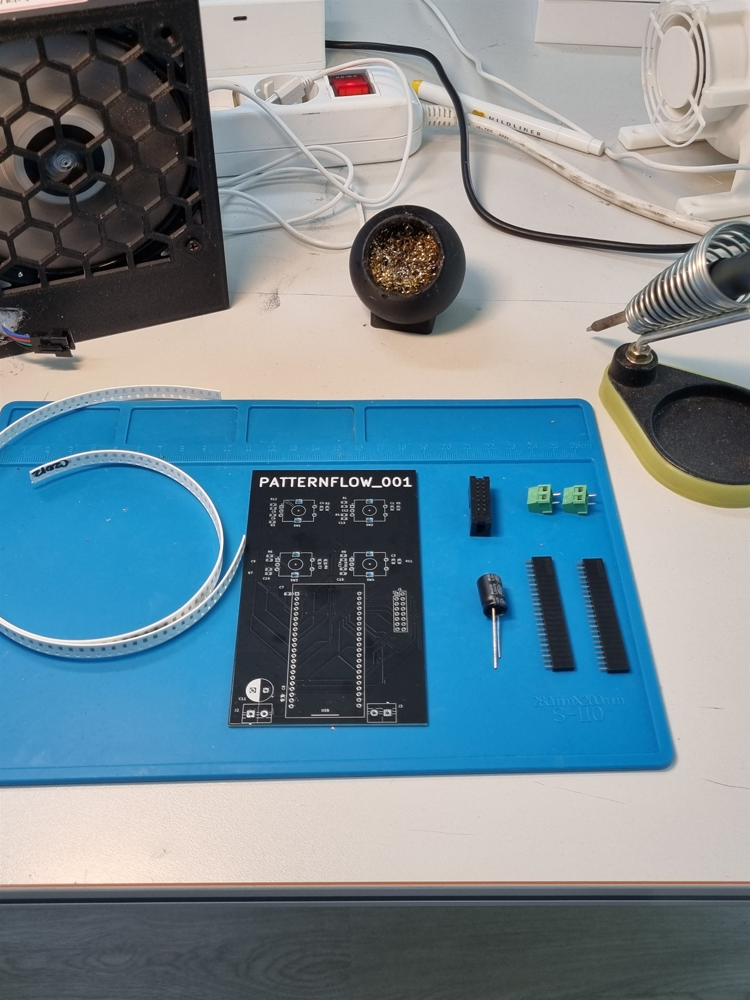
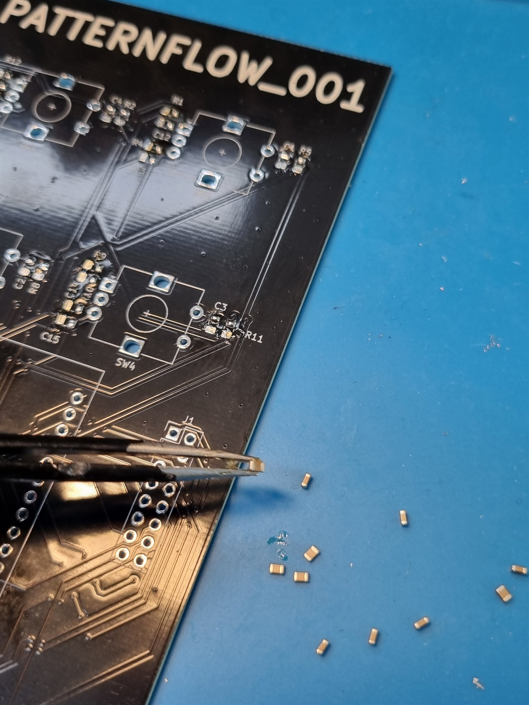
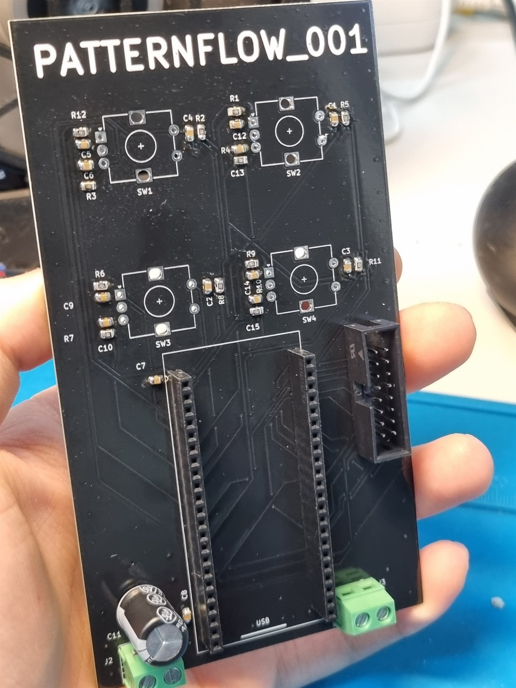
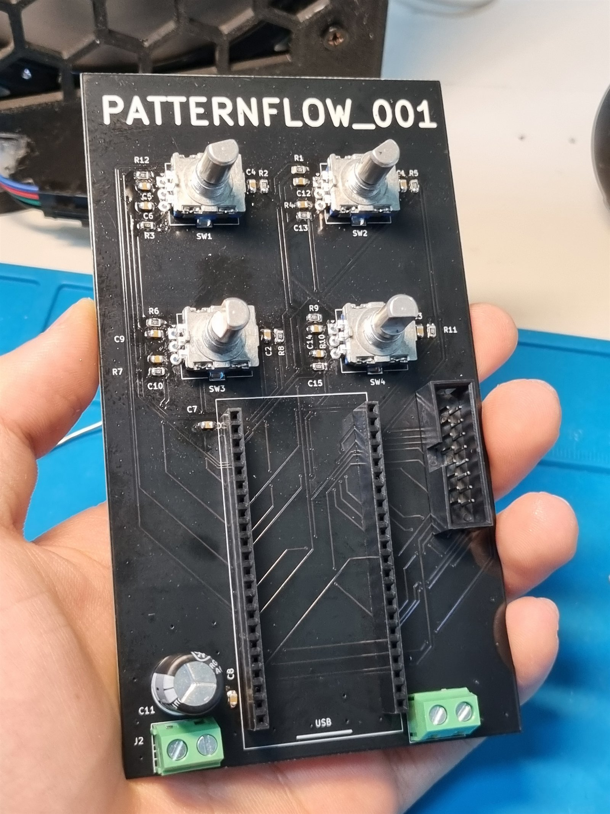
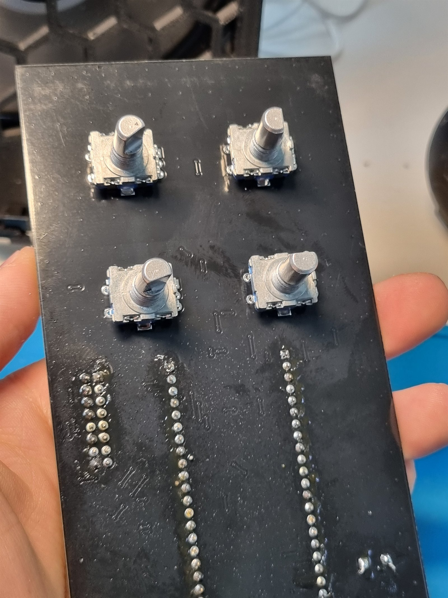

# Patternflow v2.0.0 -- Build Guide

This guide walks you through building a Patternflow v2.0.0 from scratch. It assumes basic familiarity with soldering (through-hole + simple SMD) and 3D printing.

**Estimated build time:** 4-6 hours of active work, plus ~11 hours of 3D printing.

**Skill level:** Intermediate. If you've assembled a mechanical keyboard or built an Arduino project with SMD components, you're ready.

> **What changed in v2.0.0.** PCB now includes a 10k pullup on GPIO0 (resolves the v1 cold-boot issue), silkscreen cleaned up to clearly mark R vs. C designators and the correct encoder solder side, and firmware ships with a built-in custom-pattern template usable with any AI coding assistant. The Blender source, STL files, and most of the case geometry are unchanged from v1; see Section 10 for the issues still open and the deliberate design notes worth knowing.

---

## Table of Contents

1. [Bill of Materials (BOM)](#1-bill-of-materials-bom)
2. [3D Printing](#2-3d-printing)
3. [Case Bonding](#3-case-bonding)
4. [PCB Assembly](#4-pcb-assembly)
5. [Mount the LED Matrix](#5-mount-the-led-matrix)
6. [Wire Up Power and Data](#6-wire-up-power-and-data)
7. [Install the PCB and Close the Case](#7-install-the-pcb-and-close-the-case)
8. [Firmware Upload](#8-firmware-upload)
9. [First Boot](#9-first-boot)
10. [Known Issues & Design Notes](#10-known-issues--design-notes)

---

## 1. Bill of Materials (BOM)

### Main Components

| Ref | Item | Spec | Qty | Notes |
| --- | --- | --- | --- | --- |
| - | LED Matrix Panel | HUB75, 128x64 px, P2.5, 320x160 mm | 1 | Full color SMD. Ships with HUB75 ribbon cable + power cable; both used as-is. |
| U1 | ESP32-S3 DevKit | ESP32-S3-WROOM-1, **N16R8** (16MB Flash, 8MB PSRAM), 44-pin, 25.4mm header spacing | 1 | PSRAM is required |
| SW1-SW4 | Rotary Encoder | EC11, 5-pin, 20mm shaft, with push-switch | 4 |  |
| - | Female Pin Socket (1x22, 2.54mm) | For ESP32-S3 module | 2 |  |
| J1 | Box Header (2x8, 2.54mm) | Horizontal, for HUB75 ribbon | 1 | LED matrix data |
| J2 | Screw Terminal | 2-pin, 5mm pitch | 1 | +5V input from power bank |
| J3 | Screw Terminal | 2-pin, 5mm pitch | 1 | +5V output to LED matrix |
| R1-R12 | Resistor 10k 1% | 0805 SMD | 12 | Encoder pull-ups (3 per encoder x 4) |
| R13 | Resistor 10k 1% | 0805 SMD | 1 | GPIO0 pull-up (boot strap stabilization) |
| C1-C10, C12-C15 | Capacitor 100nF X7R | 0805 SMD | 14 | 12 for encoders (3 per encoder x 4), 2 for ESP32 decoupling |
| C11 | Electrolytic Cap 1000uF / 16V | Radial D10xL13 | 1 | Main bulk decoupling |
| - | M4 Screws | ~10mm length | 6 | LED matrix mounting |
| - | USB Cable (sacrificial) | Any USB cable, will be cut | 1 | For 5V power input |
| - | Power Bank | Any standard USB power bank that physically fits | 1 | User-supplied |

### Sourcing -- AliExpress (with affiliate links)

These are the exact links I used. **Purchasing through these affiliate links directly supports the ongoing development of Patternflow at no extra cost to you.**

💡 **Found a better part?** If you discover cheaper, more reliable, or higher-quality alternative components, please let me know! I highly welcome PRs or GitHub Issues recommending better sourcing options for the community.

AliExpress shipping to most regions takes ~7-14 days.

- **Rotary Encoders (5-pack):** [EC11 20mm 5pcs — ~3,250 KRW](https://s.click.aliexpress.com/e/_c3dYYGob)
- **ESP32-S3-N16R8:** [~10,300 KRW](https://s.click.aliexpress.com/e/_c3qxYiaP)
- **LED Matrix:** [Full color 320×160mm P2.5 HUB75 — ~23,250 KRW](https://s.click.aliexpress.com/e/_c3SVdcQr)

PCB: order from your preferred fab using the KiCad files in `hardware/pcb/`. I used PCBway (sponsored).

> **A note on ESP32-S3 sourcing.** Both AliExpress modules and genuine Espressif modules work on v2.0 PCBs. During v1 development we found AliExpress modules were more likely to exhibit the cold-boot issue (now fixed by the GPIO0 pullup on v2). Genuine modules are slightly more expensive but generally more consistent; either is fine for v2.

### What you also need (not in BOM)

- 3D printer (I used Bambu P1S)
- White and black PLA filament
- Soldering iron, solder, flux, tweezers
- (Optional) solder paste + hot air rework station — see SMD section
- Wire cutters or strong nippers (for trimming the LED matrix back)
- Cyanoacrylate glue (super glue)
- Phillips screwdriver, small flathead for screw terminals
- Wrench or pliers for the encoder nuts

---

## 2. 3D Printing

### Files (in `hardware/case/print-ready/`)

| File | Contents | Color | Print Orientation |
| --- | --- | --- | --- |
| `01_plate_main.stl` | Main body (vertical, tall part) | White | Vertical (standing up) |
| `02_plate_dividers.stl` | Back covers and internal divider plates | White | Flat |
| `03_plate_knobs.stl` | All 4 knobs (one file) | Black | Standard |

**Print all three files. Each is one print job.** Knobs are bundled in a single STL — printing `03_plate_knobs.stl` once gives you all four.

### Print Settings

I used a **Bambu P1S** with default settings, with one tweak:

- **Nozzle:** 0.4mm
- **Layer height:** Default (0.2mm)
- **Infill:** Default
- **Support:** Default tree support disabled. Use **standard (regular) support** instead.
- **Brim:** Off
- **Aux fan:** Lower to ~20%
- **Total print time:** ~11 hours combined

The main body (`01_plate_main.stl`) is the long, thin part. I orient it standing up — this is the orientation the slicer will probably default to. Supports are needed and easy to remove.

> **Why standard supports, not tree:** During earlier prototypes I found tree supports more troublesome on this geometry. Standard supports remove cleanly here.

---

## 3. Case Bonding

The case prints in halves because it's too tall for most printers in one piece. Bond everything before any electronics work — glue needs time to cure, and a fully bonded case is much easier to handle later.

### 3.1 Bond the main body halves

Apply super glue along the seam between the upper and lower halves of the main body. Press firmly and hold until set.

### 3.2 Bond the back panel halves

Same procedure — bond the upper and lower halves of the back panel together.

### 3.3 Bond the internal divider

Inside the case, there's an internal divider that separates the LED matrix volume from the electronics + power bank volume. The divider has a hole for the USB cable to pass through.

**Insert the divider from the front side (the power bank / lower side), sliding it up into position.** Apply super glue along the divider edges to bond it to the case interior. Do **not** insert it from the back.

Allow ~5 minutes after every bond step for the glue to fully cure before handling.

---

## 4. PCB Assembly

Solder SMD parts first, then through-hole. Work small-to-tall — that's why SMD goes before any tall through-hole component.

### 4.1 SMD Pass (R1-R13, C1-C10, C12-C15)

> **Hand-solder vs. paste + hot air.** I hand-soldered with an iron because I didn't have solder paste or a hot air station. If you do, by all means use them — apply paste to the pads, place all parts, then reflow. The board is small enough that either approach is fine. The procedure below is for the iron-only path.

**Order: by component type.** Do all capacitors first, then all resistors (or vice versa). Mixing types makes it easier to mis-place parts.

**Hand-solder technique (batched):**

1. Pre-tin **one pad** at every SMD position you're about to populate in this pass — i.e. dab a small amount of solder onto the same side of every cap location, all at once.
2. Pick up the first capacitor with tweezers. Slide it onto its pre-tinned pad while reflowing that pad with the iron. Release. Move to the next capacitor.
3. Repeat for every capacitor. At this point all caps are tacked down on one side.
4. Go back and solder the **opposite** pad of every capacitor to lock them in.
5. Switch to resistors and repeat steps 1–4.

**Iron temperature:** ~350°C. Default works fine.

**Keep parts flat and centered.** Slight tilt will not affect function but looks bad.

> **Silkscreen.** On v2.0 PCB, R and C designators are clearly marked. Place each part according to its silkscreen designator. (On v1.0 boards, the 0805 closest to each encoder pad was a cap; this rule still works as a sanity check on v2.0.)

SMD placement close-up, then the board after the non-encoder through-hole parts are installed:

 

### 4.2 Through-Hole Pass

Solder, in order (small/short to tall):

1. **Female pin sockets (1×22 ×2)** for ESP32-S3 — these go on the **front** of the PCB. The ESP32 module will plug into these later. Do not solder the ESP32 directly.
2. **J1 (HUB75 box header), J2 (USB power input screw terminal), and J3 (LED matrix power output screw terminal)**.
3. **C11 (1000µF electrolytic)** — watch polarity (long lead = positive).
4. **Rotary encoders (SW1–SW4)** — see the critical warning below before soldering.

> **CRITICAL -- Solder rotary encoders on the BACK of the PCB.**
>
> Insert each encoder from the **back of the PCB** so its body sits on the back and its leads come through to the front, then solder the leads on the front. The v2.0 silkscreen marks this clearly -- follow it.
>
> If you solder them on the wrong side, the shafts will not reach the case front panel and the build is non-functional. Desoldering through-hole rotary encoders from a populated PCB is extremely painful -- I made this exact mistake on my own first build. **Stop and check the side twice before soldering each encoder.**

Wrong side (front) vs. correct side (back):

 

Press all parts flush against the PCB and keep them perpendicular before soldering.

### 4.3 Don't plug in the ESP32 yet

Leave the female sockets empty for now. The ESP32-S3 module gets flashed *separately* over USB-C in [Section 8](#8-firmware-upload), and only **after** flashing does it get plugged into the PCB. This avoids any chance of weird interactions during flashing and keeps the module easily removable for later updates.

### 4.4 ESP32 Pin Reference

If you're designing your own PCB or verifying wiring manually, the full pin assignment table for the ESP32-S3-WROOM-1 N16R8 DevKit as used in Patternflow is below. Most builders following this guide don't need it — the off-the-shelf PCB handles all of this — so it's collapsed by default.

<b>📌 Click to expand: full ESP32-S3 pinout</b>

Numbering is top-to-bottom with the USB connector at the top.

#### Left Side (top → bottom)

| # | Pin | Function |
| --- | --- | --- |
| 1 | 3V3 | +3.3 V supply |
| 2 | 3V3 | +3.3 V supply |
| 3 | RST | Not connected (NC) |
| 4 | IO4 | ENC1_A |
| 5 | IO5 | ENC2_A |
| 6 | IO6 | ENC3_A |
| 7 | IO7 | ENC4_A |
| 8 | IO15 | ENC2_SW |
| 9 | IO16 | ENC3_B |
| 10 | IO17 | ENC3_SW |
| 11 | IO18 | ENC4_B |
| 12 | IO8 | ENC1_B |
| 13 | IO3 | Not connected (NC) |
| 14 | IO46 | HUB_A |
| 15 | IO9 | ENC1_SW |
| 16 | IO10 | ENC2_B |
| 17 | IO11 | HUB_B |
| 18 | IO12 | HUB_D |
| 19 | IO13 | HUB_B2 |
| 20 | IO14 | HUB_OE |
| 21 | 5V | +5 V input |
| 22 | GND | GND |

#### Right Side (top → bottom)

| # | Pin | Function |
| --- | --- | --- |
| 23 | GND | GND |
| 24 | TX | Not connected (NC) |
| 25 | RX | Not connected (NC) |
| 26 | IO1 | ENC4_SW |
| 27 | IO2 | HUB_CLK |
| 28 | IO42 | HUB_R1 |
| 29 | IO41 | HUB_G1 |
| 30 | IO40 | HUB_B1 |
| 31 | IO39 | HUB_G2 |
| 32 | IO38 | HUB_R2 |
| 33 | IO37 | NC (PSRAM internal) |
| 34 | IO36 | NC (PSRAM internal) |
| 35 | IO35 | NC (PSRAM internal) |
| 36 | IO0 | GPIO0 boot strap pull-up via R13 |
| 37 | IO45 | Not connected (NC) |
| 38 | IO48 | HUB_C |
| 39 | IO47 | HUB_LAT |
| 40 | IO21 | HUB_E |
| 41 | IO20 | Not connected (NC) |
| 42 | IO19 | Not connected (NC) |
| 43 | GND | GND |
| 44 | GND | GND |

> IO35–IO37 are internally connected to the PSRAM on the N16R8 variant. Do not use these pins for external connections.

---

## 5. Mount the LED Matrix

### 5.1 Trim the LED matrix mounting bumps

The LED matrix has two small alignment bumps on its back, diagonally opposite each other. These prevent it from sitting flat against the case.

**Cut them off with strong nippers or pliers.** Slight residual nubs are fine — flat enough is flat enough.

> A future case revision will include recesses for these bumps so trimming isn't needed.

 

### 5.2 Screw the matrix into the case

1. From the front of the case, lower the LED matrix into its slot.
2. Flip the case over.
3. From the back, secure the matrix with the M4 screws (×6).

> The screws thread directly into the LED matrix's mounting holes. Don't over-tighten.

---

## 6. Wire Up Power and Data

At this point the matrix is in the case but the PCB is **not** yet installed. You'll do all the wire-side work first — connecting the USB power input, the matrix power, and the HUB75 ribbon to the PCB while it's still loose and easy to handle. Then in Section 7 the whole PCB-with-cables-attached assembly drops into the case.

### 6.1 Wire the USB power input to J2

Cut the sacrificial USB cable short — trim it to a length that routes from the power bank compartment, through the divider hole, to the PCB position without excessive slack. Strip the +5V (red) and GND (black) wires.

Pass the cable through the divider hole. Connect to **J2** (with the PCB-side facing you):

- **Inner terminal → +5V (red)**
- **Outer terminal → GND (black)**

Tighten with a small flathead.

### 6.2 Wire the LED matrix power to J3

The LED matrix ships with a power cable (red/black) that has two red (+) and two black (−) wires. Hold it up to estimate reach to **J3** before cutting — give it just enough length to route cleanly without strain. Then cut, strip, and bundle each pair (the two reds together, the two blacks together) before inserting.

Polarity matches J2: **inner = +5V (red pair)**, **outer = GND (black pair)**.

> ⚠️ Watch polarity. Reversing it will damage the matrix.
>
> J2 (input) and J3 (output to LED matrix) are connected internally on the PCB. You don't need to bridge them externally — the PCB handles +5V distribution.

> 📏 *Exact recommended cable lengths will be added to this guide in a future revision. For now, measure against your specific case + power bank position.*

### 6.3 Connect the HUB75 ribbon to J1

The HUB75 ribbon cable that ships with the matrix is used **as-is — do not cut it**. Just plug one end into the matrix's data input and the other end into **J1** on the PCB. The keying on the box header ensures correct orientation.

---

## 7. Install the PCB and Close the Case

### 7.1 Insert the PCB

The PCB sits in the dedicated PCB slot, with the rotary encoders facing through the case front. The slot is intentionally tight in v1.0.

1. Hold the PCB at an angle, encoder side down.
2. Slide the bottom row of encoders into their case slots first.
3. While tilting the PCB toward flat, guide the upper encoders into their slots simultaneously.
4. Push the PCB flat against the case interior.

<video src="build-guide/images/pcb_insert.webm" autoplay loop muted playsinline width="45%"></video> 

### 7.2 Secure the encoders from the front

From the **front** of the case, attach each rotary encoder's nut and tighten with a wrench or pliers. This both secures the encoder shafts to the front face and locks the PCB in place.

### 7.3 Attach the back cover

Slide the back cover panel into place along the rear of the case.

### 7.4 Close the PCB compartment slider

Slide the PCB compartment cover panel into its slot to close off the electronics section.

### 7.5 Attach the knobs

Press-fit the four black knobs onto the encoder shafts.

At this point the **Patternflow body is mechanically complete.** The only thing left is the brain.

---

## 8. Firmware Upload

There are two ways to flash firmware: the browser-based flasher (recommended, no toolchain needed) or Arduino IDE for manual/custom builds. The ESP32-S3 module is flashed *separately*, with the module **outside** the PCB, and only plugged in afterwards.

### 8.1 Browser Flash (Recommended)

No installation required. Works on any desktop with Chrome or Edge.

1. Visit **[patternflow.work](https://patternflow.work)** on a desktop browser.
2. Connect your ESP32-S3 to your computer via a USB-C **data cable** — do not insert it into the PCB yet.
3. Scroll to the **Patterns** section and click **"Flash Patternflow OS"**.
4. Select the correct serial port when prompted and follow the on-screen steps.

5. Once flashing is complete, disconnect the USB-C cable.

> ⚠️ The Web Serial API is only supported on **desktop Chrome and Edge**. Firefox and Safari are not supported.

### 8.2 Arduino IDE (Manual / Custom Builds)

Use this method if you want to modify the firmware source, or if the browser flasher doesn't work for your setup.

#### Prerequisites

- Arduino IDE (latest version)
- ESP32 board package installed (Tools → Board → Boards Manager → search "esp32")

#### Board Settings

In Arduino IDE, **Tools** menu:

- **Board:** ESP32S3 Dev Module
- **PSRAM:** OPI PSRAM
- **Flash Size:** 16MB
- **Partition Scheme:** 16M Flash (3MB APP/9.9MB FATFS) or similar with PSRAM-aware partition
- **USB CDC On Boot:** Disabled
- **Upload Mode:** UART0 / Hardware CDC

#### Upload

The firmware sketch lives in `firmware/patternflow/`. The folder contains:

| File | Role |
| --- | --- |
| `patternflow.ino` | Main sketch — entry point, `setup()` / `loop()` |
| `config.h` | Pin mappings, brightness, pattern parameter limits — edit this for custom hardware |
| `core_display.h` | HUB75 display driver and rendering pipeline |
| `core_encoders.h` | Rotary encoder handling and parameter update logic |
| `pattern_origin.h` | Built-in pattern: Origin |
| `pattern_wave_saw.h` | Built-in pattern: Wave Saw |

1. Connect the ESP32-S3 module to your computer with a USB-C data cable.
2. Select the correct port under **Tools → Port**.
3. Open `firmware/patternflow/patternflow.ino`. Arduino IDE will load all the `.h` files in the same folder automatically.
4. If you're building for custom hardware, edit `config.h` to adjust pin mappings, brightness, or pattern limits.
5. Click **Upload**.

If the upload fails, hold **BOOT** on the ESP32-S3 while pressing **RESET**, then click Upload again.

### 8.3 OTA (Preview)

OTA updates work via Arduino IDE's network port option once the device has been on the same Wi-Fi network at least once. **OTA in v2.0.0 is functional but not the recommended path.** Use the browser flasher or wired upload as the primary method.

### 8.4 Insert the flashed ESP32 into the PCB

With flashing complete and the USB cable disconnected, plug the ESP32-S3 module into the female pin sockets on the Patternflow PCB.

---

## 9. First Boot

1. Slide a power bank into the battery compartment.
2. Slide the battery cover into place to hold it.
3. Connect the power bank to the USB cable wired into J2.
4. The LED matrix should illuminate with the default pattern within a second or two.
5. Turn the four knobs to confirm they all respond.

> If your unit does not boot reliably, press RESET on the ESP32-S3 module once. On v2.0 boards this should not be necessary -- if it consistently is, [open an issue](https://github.com/engmung/PatternFlow/issues) with your module source (AliExpress / Espressif / other) and a photo of the GPIO0 area on your PCB.

---

## 10. Known Issues & Design Notes

### Fixed in v2.0

- **Cold-boot reliability** (was Issue #1). GPIO0 is a strapping pin on the ESP32-S3 and was left floating in v1.0. After extended power-off, residual charge could leak into an indeterminate state, sometimes registering LOW on power-on and sending the module into serial bootloader mode instead of normal boot -- looking exactly like "boot failure." v2.0 adds a 10k pullup from GPIO0 to 3.3V on the PCB. Full debugging story in [Issue #16](https://github.com/engmung/PatternFlow/issues/16). Two weeks of debugging compressed into one comment from u/Infrated on r/AskElectronics. Genuine Espressif modules tended not to exhibit the issue at all, but v2.0 covers both genuine and clone modules.

- **Silkscreen ambiguity** (was Issue #3). 0805 resistor vs. capacitor designators are now clearly marked, and the correct encoder solder side is on the silkscreen.

### Still open

- **Issue #4 -- LED matrix back has alignment bumps.** The matrix manufacturer leaves two small alignment bumps on the back of the panel. Current workaround: cut them off during assembly (see Section 5.1). They cut easily. A future case revision (planned to land with the LED diffuser variant) will add recesses to accommodate them.

### Design notes (not bugs)

- **Encoder direction handled in firmware** (was Issue #2). The encoder PCB footprint is rotated relative to the natural CW=increment direction. Rather than re-spinning the PCB, the firmware inverts the sign. This is transparent to the user. If you fork the firmware or design a derivative PCB, mind this.

- **C11 (1000uF electrolytic) retained.** Issue #16 discussion noted that 1000uF is roughly 100x over the USB inrush spec for desktop-USB-powered devices -- and that is correct. Patternflow is powered by a power bank, not a desktop USB port, so the inrush argument does not apply. Without C11 the panel can flicker visibly during the boot transient, so it stays. If you are designing a derivative that connects to a host PC, drop C11 to <=50uF.

- **Encoder shaft length variants** (was Issue #5). The BOM uses 20mm shaft encoders, and the print-ready knob STL is sized for 20mm. If you have 15mm shafts on hand, a 15mm knob model is included in the Blender source at hardware/case/source/ -- open it, export the 15mm knob, and print that instead.

---

## Questions, contributions, fixes

This is Patternflow v2.0.0. The cold-boot issue is fixed; the case still needs manual matrix-bump trimming. The remaining open item is listed above.

If you build one -- please open an issue on GitHub with photos and any notes. If something in this guide was unclear or wrong, send a PR. If you fix one of the Known Issues, you will be credited as a contributor.

-- SeungHun
