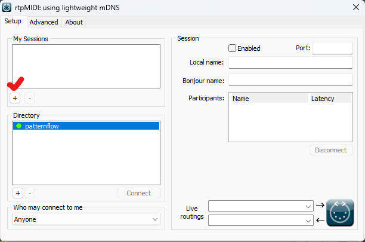
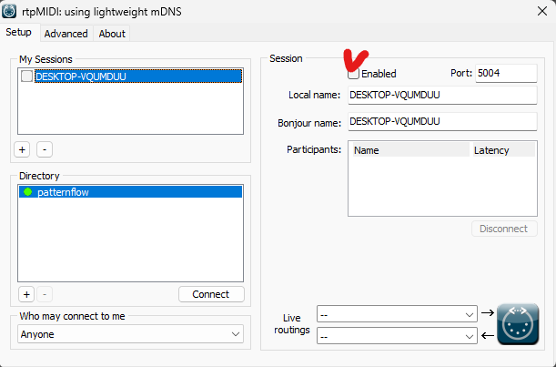
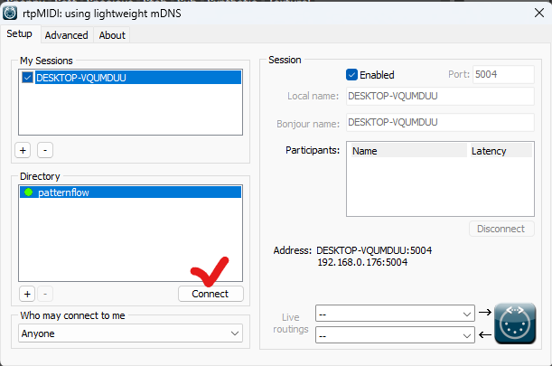
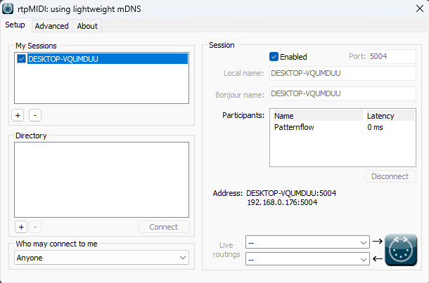
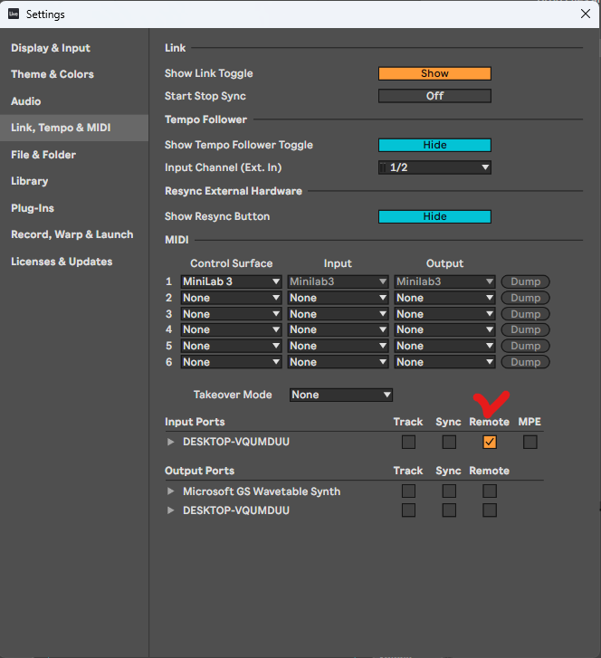

# Patternflow in Ableton Live — the panel as a MIDI controller

Five screenshots from a Windows machine, start to finish. At the end the
panel's four knobs and four buttons are a MIDI port in Live, mappable to
anything with Ctrl-M, and Live can drive the panel back with clips.

Needs the **Audio edition** on the panel (v0.5.0 or later — the console's
nav shows a **MIDI** tab) and the panel on the same Wi-Fi as the computer.
macOS users: skip the driver, the same steps happen in *Audio MIDI Setup →
Window → Show MIDI Studio → Network*.

## 1. Install rtpMIDI

Windows does not speak network MIDI on its own. Tobias Erichsen's
**rtpMIDI** driver is free and does exactly this one thing:
<https://www.tobias-erichsen.de/software/rtpmidi.html>. Install it, open it.

## 2. Make a session

Under **My Sessions**, press **+**. A session named after your computer
appears. (The panel is already listed in **Directory** as `patternflow` —
that is Bonjour finding it. If it is not there yet, give it a few seconds,
or add it with the Directory's **+** using the panel's address and port
`5004`.)

## 3. Enable the session

Tick **Enabled** at the top of the Session box. Leave the port at 5004 and
**Who may connect to me** at *Anyone* — that is what lets the panel call
your computer by itself later.

## 4. Connect to the panel

Select `patternflow` in **Directory** and press **Connect**.

`Patternflow` moves into **Participants** with a latency of a few
milliseconds. Done on this side — you can close the window; the driver
keeps running.

## 5. Tell Live about the port

Live → **Settings → Link, Tempo & MIDI**. Under **Input Ports**, on the row
named after your computer (the rtpMIDI session), tick **Remote** — that is
what lets the knobs be MIDI-mapped. Tick **Track** too if you want the
buttons to play notes on a track. Under **Output Ports**, tick **Track** on
the same row so clips can be sent to the panel.

## Now map something

Press **Ctrl-M**, click any knob or slider in Live, turn a knob on the
panel, press Ctrl-M again. The panel sends an ordinary 0–127 knob value, so
there is nothing for Live to guess about: it moves both ways at the same
speed and stops at the ends.

Two things to know:

- **How far a turn goes** is set on the panel's console, **MIDI** page
  (`http://patternflow.local/midi`): one slider per knob from ×8 (a quarter
  turn end to end) through 1:1 to 1/16 (ten turns), moved together or one
  by one. It is remembered across reboots.
- **Takeover.** After a knob hits an end and comes back, Live's *Takeover
  Mode* (same Settings page) decides how the parameter picks up — *Value
  Scaling* is the smooth choice.

## Never reconnect again

On the MIDI page, press **Use this computer**. The panel remembers the
address and opens the session itself every time it boots or the session
drops, so rtpMIDI never needs opening again. (It waits 20 s first to give
rtpMIDI's own reconnect a chance, which is why a fresh boot takes a moment.)

## Driving the panel from Live

Put a MIDI track's **MIDI To** on the rtpMIDI port and anything on that
track reaches the panel:

- **CC 20–23** pin knobs 1–4 to an absolute value until a hand turns them.
  The Pattern Lab's Director exports a show as exactly these four lanes
  ([director-midi.md](director-midi.md)) — drop that `.mid` on the track
  and the show plays on the panel from Live's transport.
- **Program Change** picks the pattern by its index on `/patterns`.
- **Notes 60–63** press buttons 1–4.

The full contract is [midi-spec.md](midi-spec.md).

## If something is off

| Symptom | Cause |
|---|---|
| `patternflow` missing from Directory | Not the same Wi-Fi, or Bonjour blocked. Add it by address: the panel's IP is on its NETWORK screen and on the console's MIDI page, port 5004. |
| Connected in rtpMIDI, nothing moves in Live | **Remote** is not ticked on the input port (step 5). |
| Knob turns move the wrong parameter | Ctrl-M mappings are per set; check the mapping list on the left in map mode. |
| Every note arrives twice | Two sessions to the same panel — close one in rtpMIDI (only one is needed; the panel keeps at most two participants). |
| A knob barely moves the parameter, or jumps | The panel is on **Relative steps** mode on its MIDI page while Live guessed the encoder type wrong. Use **Knob value** with Live. |
