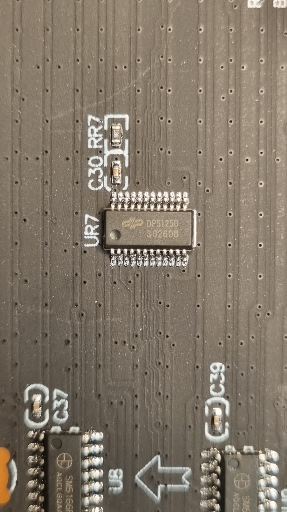
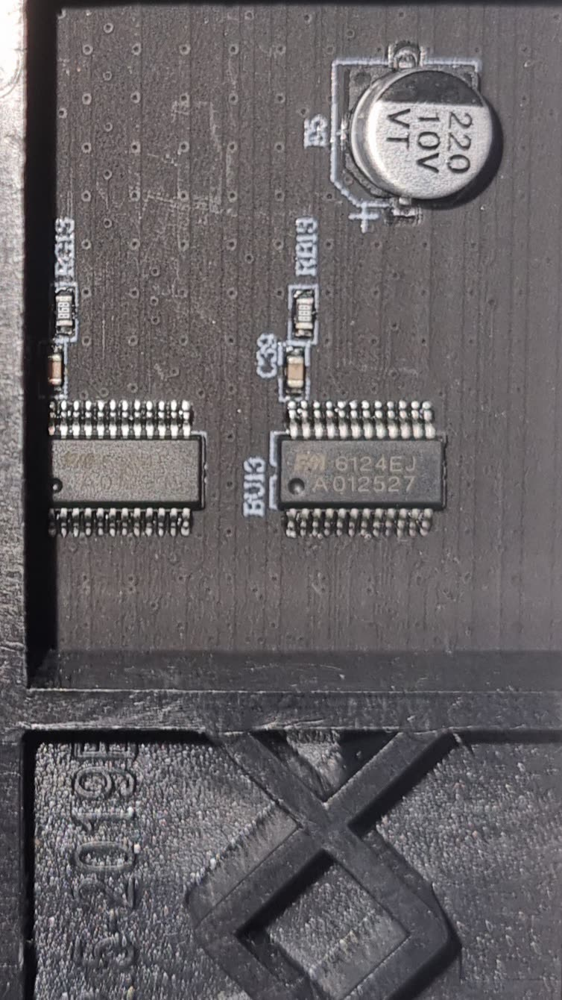
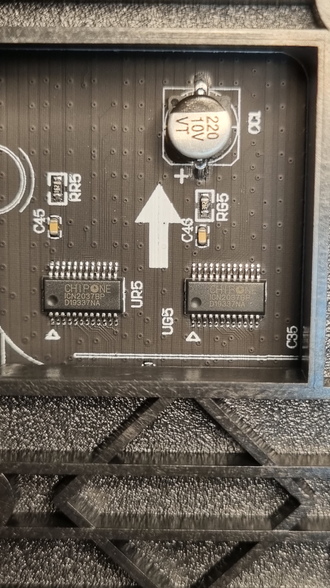

# LED Panel Compatibility

Patternflow drives the LED panel **directly from the ESP32-S3** — no sending card, no receiving card, nothing in between. That makes the **driver ICs on the back of the panel** the thing that decides whether your build lights up.

Which would be simple advice, except for one problem: **that part number is almost never in the listing you're buying from.** We checked (§1). So this page is in two halves — what you can actually do *before* you pay, and what to do once the panel is in your hands.

The failure this prevents: a panel that matches Patternflow's spec line for line — HUB75E, 128×64, P2.5, 320×160 mm — wired perfectly, correct firmware, serial log reporting success, and the panel sits there **completely black**.

> **In a hurry?** Buy the [BOM-linked panel](../hardware/bom/README.md). It's verified, and its mounting holes match the case. Everything below is for going off-script.

---

# Part I — Before you buy

## 1. What a listing actually tells you

We audited the BOM-linked listing — the panel we *know* works — to see what a buyer can find out:

| Where you'd look | What's actually there |
|---|---|
| Title | Resolution, pitch, size, "HUB75". **No driver IC** |
| Spec table | Pitch, SMD 2121 package, 5 V / 30 W, HUB-75 interface, **1/32 scan**, dimensions, weight. **No driver IC** |
| Marketplace AI summary | Restates the above. **No driver IC** |
| Attached PDF "user manual" | EU compliance boilerplate. **No driver IC** — and see the trap below |
| **Buyer reviews** | 🎯 **ESP32 confirmations, seller-contact reports, photos of the board** |

**Don't plan on finding the chip. Plan on reading the reviews.**

> ⚠️ **The boilerplate trap.** That PDF manual — attached to a panel verified on a bare ESP32-S3 — says *"This module cannot operate independently and must be used in conjunction with a compatible control system, receiving card, and power supply."* It's a generic document the factory ships with every module it makes, and **taken literally it would reject a known-good panel.** Judge the listing, not the PDF. (Its one useful line points the other way: *"for modules with high refresh rate chips (such as those supporting PWM dimming), it is strictly prohibited for users to DIY"* — the manufacturer agrees that the **PWM** modules are the DIY-hostile ones.)

## 2. Read the reviews first

This is the highest-value thing you can do, it's free, and it takes a minute.

**Search the reviews for:** `ESP32` · `Arduino` · `Raspberry Pi` · `HUB75` · `DMA` · `WLED` · `Pixelblaze`

On the BOM listing, that turns up:
- an auto-extracted review tag reading *"compatible with Raspberry Pi"*
- a buyer who drove it from an **ESP32** (and passed on a config tip — `64×64` with `chain 2`)
- a buyer who **questioned the seller in advance**, got detailed answers, and then had an **ESP32-S3** displaying images

That is better evidence than any spec table, because somebody already ran the exact test you care about. **Also open the review photos** — buyers routinely shoot the back of the panel, and the driver chip is sitting right there for you to read with §7.

No reviews at all, or none from anyone driving it with a microcontroller? Treat the panel as unknown and go to §4.

## 3. Where you buy changes the odds

Risk tracks the sales channel far more than the price:

| Channel | What to expect | What to do |
|---|---|---|
| **The [BOM link](../hardware/bom/README.md)** | Verified panel, verified mounting-hole positions | Nothing. Just buy it |
| **Maker retailers** — Adafruit, Waveshare "HUB75 for ESP32", DIY kit sellers | Classic drivers are the norm; these exist to be driven by an MCU | Skim the spec and go |
| **General AliExpress / Alibaba "HUB75 P2.5 module"** | Mixed. The fine-pitch end increasingly serves commercial video-wall controllers | Reviews (§2), then ask (§4) |
| **"For Novastar / Huidu / Colorlight", "rental wall"** | Built for receiving cards | Don't |

**Rule of thumb:** the more a *listing* leads with **refresh rate** (1920/3840 Hz) or names a **sending/receiving card brand**, the more likely it's the incompatible kind. The more it mentions *Arduino, ESP32, Raspberry Pi, Matrix Portal*, the better. Industry has drifted toward S-PWM for years — better grayscale, less load on the controller — so a brand-new fine-pitch module aimed at commercial installs is a worse bet than an older, simpler design.

## 4. Ask the seller

They do answer — a reviewer on the BOM listing confirmed exactly this. Copy-paste:

```text
I need an indoor RGB LED matrix module for a DIY ESP32 project.
The MCU scans the panel directly — there is no receiving card.

Required:
- Interface: HUB75 / HUB75E ribbon
- Resolution: 128x64, pitch P2.5 (320x160 mm)
- Scan: 1/32 indoor "two-scan" style
- Driver ICs must be classic shift-register / dual-latch type.
  Acceptable: 74HC595, FM6124, FM6126/FM6126A, ICN2037, ICN2038S,
  DP5125, DP3246, MBI5124, SM162xx, or similar.
- Must work with the ESP32-HUB75-MatrixPanel-DMA library.

NOT acceptable:
- S-PWM / PWM "smart" drivers with built-in memory
  (ICN2053, FM6353, FM6363, FM6373, DP3264/DP3265,
   ICND2055, MBI5051/5052/5053, MBI6024, etc.)
- Modules intended only for Novastar / Huidu / Colorlight receiving cards

Please confirm BEFORE shipping:
1) Exact LED driver IC part number(s) — the chip repeated across the
   whole board, not the buffer next to the connector
2) Exact row / multiplexer IC part number(s), if present
3) Resolution, scan rate (e.g. 32S), and whether the E pin is used
4) A clear photo of the back of the PCB showing the chip markings
```

If they can't name the chips, or answer only "HUB75, works with Novastar" — walk away. If they send the photo, read it yourself with §7.

## 5. Optional: have an AI assistant triage the listing

Useful for a listing in a language you don't read, or for sorting several candidates. Paste this into ChatGPT / Claude / Gemini:

```text
I'm buying an LED matrix panel for a DIY project where an ESP32 scans
the panel directly (library: ESP32-HUB75-MatrixPanel-DMA). There is no
sending card and no receiving card.

Listing: <paste the URL>
Compatibility guide I'm working from: <paste this page's URL>

Please:
1. Read the BUYER REVIEWS first. Quote anything mentioning ESP32,
   Arduino, Raspberry Pi, HUB75, WLED or any DIY controller — that is
   the strongest evidence available. Check review photos for the chips.
2. Check the title and spec table for the red flags in the guide
   (1920/3840 Hz refresh, "for Novastar/Colorlight/Huidu", sold as
   video-wall hardware). IGNORE boilerplate in any attached PDF manual;
   it says "receiving card required" even on panels that work fine.
3. Report the resolution, pixel pitch and scan rate if stated.
4. Say whether the driver IC is stated ANYWHERE. It usually isn't.
   Do not guess it — if it's not stated, say so plainly.
5. Verdict: likely fine / unknown / red flags. Then write the exact
   question I should send the seller.
```

**It cannot see the chip either.** If the listing doesn't say, no assistant can conjure it, and one that answers confidently is guessing. Use this to sort candidates — then still do §4.

---

# Part II — The panel is here

## 6. Flash stock first, always

**Don't pick a setting from the part number.** `PANEL_PROFILE` in [`firmware/patternflow/config.h`](../firmware/patternflow/config.h) defaults to `PANEL_STANDARD`, which sends **no init sequence at all**, and that drives most panels — including the reference build's FM6124.

1. Flash the stock firmware (`PANEL_STANDARD`). **Lights up? You're done** — no change, whatever the chip is stamped.
2. **Completely dark?** Some chips power up with their output disabled until two registers are written. Build once with the profile matching your chip (table below) and retry.
3. Still dark → check power and that the ribbon is on the panel's `IN`, then suspect the chip is the S-PWM kind (§9).

| `PANEL_PROFILE` | Library driver | What it actually does | Use for |
|---|---|---|---|
| `PANEL_STANDARD` *(default)* | `SHIFTREG` | Nothing — no init sequence | 74HC595 and any classic chip with no dedicated value below |
| `PANEL_HIGHREFRESH` | `FM6126A` | `fm6124init()` — writes two config registers | FM6126 / FM6126A |
| `PANEL_FM6124` | `FM6124` | **the same** `fm6124init()` | FM6124 |
| `PANEL_ICN2038S` | `ICN2038S` | **the same** `fm6124init()` | ICN2038 / ICN2038S |
| `PANEL_MBI5124` | `MBI5124` | Sets `clkphase = true`, nothing else | MBI5124 (latches on the clock's rising edge) |
| `PANEL_DP3246` | `DP3246` | `dp3246init()` + `clkphase = true` | DP3246-class |

Six names, **four distinct behaviours** — verified in the library's `shiftDriver()`. `FM6126A`, `FM6124` and `ICN2038S` dispatch to one identical function with no per-chip branch, so picking between those three changes nothing.

The **browser flasher** ships `PANEL_STANDARD`, since one image serves everyone. A panel that genuinely needs another profile needs one custom build — Arduino IDE, or Pattern Lab's **Build firmware** ([`firmware/README.md`](../firmware/README.md)).

## 7. Reading the chip off a board you own

### Which chip is *the* chip?

The back of a panel carries several classes of IC, and only one is the one this page is about.

| Where it sits | What it is | Does it matter? |
|---|---|---|
| **Repeated in a regular grid across the whole board** — a dozen or more of the same part number | **The LED driver IC** | ✅ **This is the one** |
| One or two, right next to the HUB75 input connector | Buffer / level shifter — almost always `74HC245` or `74HCT245` | ❌ Ignore it |
| A small cluster along one edge | Row/scan decoder — `SM5166`, `74HC138`, `ICN2012`, `SM5368`, `TC7258`, sometimes a `74HC595` | Secondary; worth quoting to a seller |

**The rule: whichever part number is repeated the most, spread evenly over the panel, is the driver.** Each one handles a block of columns, so there are always many.

⚠️ **The common trap:** seeing `74HC245` beside the connector and reading it as "74HC595, which is on the compatible list." It isn't — the `245` is a buffer present on practically every panel, compatible or not. And because a `74HC595` genuinely can appear as the *row* decoder, position matters as much as the number.

Both classes in one frame, on a real panel:



The chip in the middle at `UR7` is **`DP5125D`** — the LED driver, repeating in a grid all across the board. The two wider chips along the bottom edge at `U8` are **`SM5166P`**, the row/scan drivers: they sit in a line at the board edge instead of tiling the surface, and there are only a handful. **Read the one in the middle.**

Then: photograph it with the flash at an angle (the marking is often faint laser etch), note the silkscreen model string too, and look it up in §8.

> **Shortcut if the panel already works.** A panel running on stock Patternflow is on `PANEL_STANDARD` — no init sequence — so it's a plain shift-register-compatible panel whatever the chip says. You never need to identify it. This section is for a *new* panel, or a dark one.

### Decoding the silkscreen string

e.g. `P2.5(2121)-32S-320X160-V6.1`

| Fragment | Meaning |
|---|---|
| `P2.5` / `P3` / `P4` | Pixel pitch in mm |
| `2121` / `1515` | LED package size |
| `16S` / `32S` | Scan rate (1/16, 1/32) |
| `320X160` | Physical size in mm — 320×160 at P2.5 is 128×64 pixels, Patternflow's panel |
| `HUB75E` | Connector, and the E address line is probably in use |

## 8. Symptom → likely cause

| Symptom | Likely cause |
|---|---|
| **Completely black**, serial says init OK, a known-good panel works on the same board | S-PWM / receiving-card driver ICs (§9) |
| Works, but the first row or column is corrupted | `clkphase` — flip it in `core_display.h` |
| Scrambled blocks / mirrored quarters | Wrong scan mapping (often an outdoor 1/4-scan panel) |
| Dim, flickering, random sparkles | Power delivery, shared ground, or 3.3 V logic marginal at this cable length |
| Colors or ghosting wrong | Wrong `PANEL_PROFILE` — try the matching value from §6 |
| Banding across long smooth gradients | Refresh target too high; lower `min_refresh_rate` toward 180 ([`core_display.h`](../firmware/patternflow/src/core_display.h)) |
| Init fails or crashes on large panels | DMA RAM — confirm the module is an **N16R8** with PSRAM enabled |

---

# Part III — Reference

## 9. Why "HUB75E" guarantees nothing, and the three tiers

HUB75 / HUB75E describes a 16-pin IDC ribbon and a set of signal names. It says nothing about the protocol behind those pins — like a USB-C plug: same shape, many different things behind it.

| It defines | It does **not** define |
|---|---|
| Pin order: R1 G1 B1 R2 G2 B2, A B C D (E), CLK LAT OE, GND | Which driver chips are on the back |
| That the panel wants 5 V | Whether an MCU can scan it at all |
| That "E" means five address lines (A–E), typical of 64-row / 1-32 scan panels | Scan mapping quirks (four-scan / outdoor layouts) |

Behind the connector there are three tiers, and the first two both work.

**✅ Tier 1 — plain shift-register.** The MCU scans the rows and generates the brightness modulation itself in timing. These come up ready; the firmware writes nothing. `PANEL_STANDARD`, nothing to change.

> **74HC595** · **FM6124** ✅ · **ICN2037 / ICND2037** ✅ · **DP5125D** ✅ · **DP3216** · **DP5124** · **ICND2012** · **RUC7258** · **SM16206 / SM16207 / SM16208 / SM16306** · **TC5020** · **SC6616** · **MY9868**

**✅ Tier 2 — needs an init sequence.** Same architecture, but the chip powers up with its output disabled until a couple of config registers are written. The library sends that init itself — no video card involved.

> **FM6126 / FM6126A** · **ICN2038S / ICND2038** · **ICND2045** · **FM6047** · **DP3246** · **SM16227 / SM16237** · **MBI5124** (clock-phase only)

**❌ Tier 3 — S-PWM / "smart" / receiving-card.** On-chip memory, generating PWM themselves. A controller sends frame and config data, then a separate grey-scale clock (GCLK) runs the output. Built to be fed by **Novastar / Huidu / Colorlight** receiving cards from a video source.

> **ICN2053** · **FM6353** · **FM6363 / FM6363C** · **FM6373 / FM6373C** · **DP3264 / DP3265** · **ICND1065** · **ICND2055 / ICND2055CP** · **ICND2153** · **SM16380** · **MBI5051 / MBI5052 / MBI5053** · **MBI6024** · **HX6158SP**

Tier 3 needs a GCLK signal and an addressing scheme the library cannot generate ([upstream issue #642](https://github.com/mrcodetastic/ESP32-HUB75-MatrixPanel-DMA/issues/642), closed *wontfix*). No firmware setting rescues them — but see §11.

Note **FM6124 is Tier 1 and FM6126 is Tier 2** — one digit apart, different requirement. That's exactly why §6 says try the default first instead of looking up your part number.

> **How solid is any of this?** The *architecture* is certain — the library scans the panel itself and emits no grey-scale clock, so a chip that expects one cannot work — and §6's table is read straight out of the library source. Individual *part numbers* are cross-checked against the [library README](https://github.com/mrcodetastic/ESP32-HUB75-MatrixPanel-DMA), the [DMD_STM32 driver chart](https://github.com/board707/DMD_STM32/wiki/Led_drivers), and panels actually run on Patternflow (✅). Two are disputed: **`RUL6024`** (upstream calls it S-PWM, the DMD chart calls it FM6126-compatible) and **`DP3364 / DP3364S`** (circulates in buyer's guides as S-PWM but appears in none of the sources). Treat both as unknown.
>
> **And absence from these lists is not a verdict.** `ICN2037` and `DP5125D` both run fine and neither has a dedicated entry in the library. The hard stop is the Tier 3 architecture, not a missing part number.

## 10. Verified panels

Panels someone has actually run on Patternflow — not inferred from a datasheet.

| LED driver IC | Marking | Profile that works | Notes |
|---|---|---|---|
| **FM6124** | `FM6124EJ` / `A012527` | `PANEL_STANDARD` | The [BOM-linked](../hardware/bom/README.md) 128×64 P2.5 320×160 panel — the reference build |
| **ICN2037** (Chipone) | `ICN2037BP` / `D19337NA`, `D01170MA` | `PANEL_STANDARD` | Two panels, same chip, different lots |
| **DP5125D** | `DP5125D` / `3G2608` | `PANEL_STANDARD` | Row driver on the same panel: `SM5166P` |

| `FM6124EJ` | `ICN2037BP` | `DP5125D` |
|---|---|---|
|  |  |  |

All three run with **no init sequence at all**, on the stock flasher image — and two of them, `ICN2037` and `DP5125D`, don't appear in the library's driver list at all.

## 11. If you already bought an S-PWM panel

It isn't broken, it's a different class of hardware. Options, best first:

1. **If it's ICN2053 or FM6353** — there's a **dedicated fork** of the library for these built-in-memory panels, by LAutour: [ESP32-HUB75-MatrixPanel-DMA-ICN2053](https://sourceforge.net/projects/esp32-hub75-dma-icn2053/) (the upstream README points at it). It won't drop into Patternflow unmodified, but the panel is not a paperweight.
2. Drive it with a **Novastar (or compatible) receiving card** — the correct tool for that panel. The normal chain is `media player / sender → Ethernet → receiving card → panel`. An ESP32 cannot usefully talk *through* a receiving card as if it were a display adapter.
3. Buy a Tier 1 / Tier 2 panel for the Patternflow build (§3).

---

## Report your panel

Running something other than the BOM-linked panel? **Please tell us how it went — working or not.** Every report makes this page better for the next person: [#224](https://github.com/engmung/Patternflow/issues/224).

Useful to include: driver IC part number **and its lot code line**, silkscreen model string, resolution and scan rate, which `PANEL_PROFILE` you used, and a close-up of the back of the PCB — framed like the three in §10, close enough to read the chip. Those go straight into the verified table.

---

*Every panel I happened to own worked, so this was never on my radar. [@SimonePDA](https://github.com/SimonePDA) ran into the failure, raised it, went and researched it properly, and proposed what to do about it — which opened up a part of Patternflow I'd been blind to. A panel that lights up is where every build starts. Thank you.*
