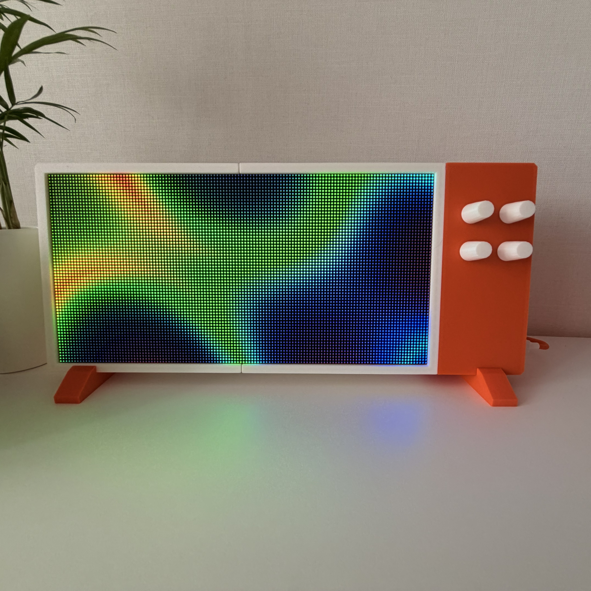
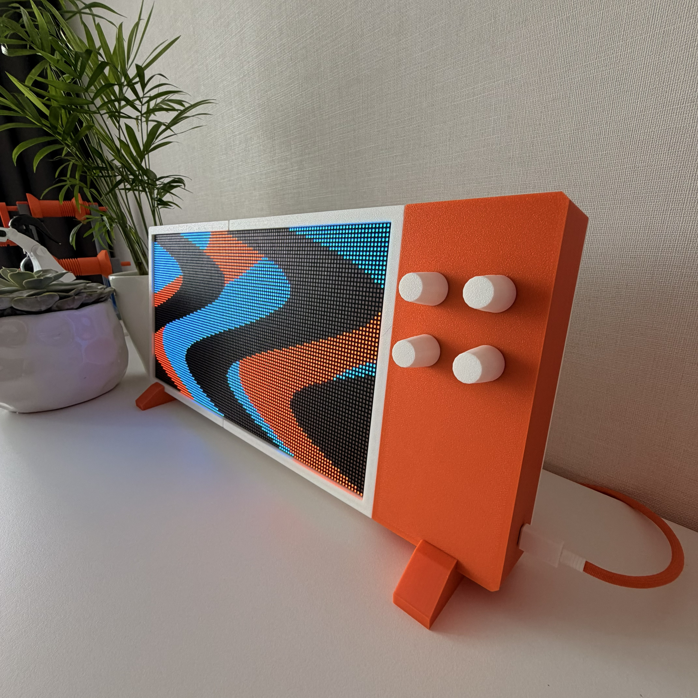

Author: Mykyta Bilous (mbchars), https://github.com/mbchars
License: CC-BY-SA-4.0  
Based on: Patternflow enclosure by engmung / SeungHun Lee; 
Fits: Patternflow v3.0 controller PCB; 320 × 160 mm LED panel with the tested hole pattern  
Material: PLA; Bambu P2S; 0.4 mm nozzle; 0.20 mm layers; textured plate. 
Verified: 2026-10-07; assembled by the author; photographs below

# Horizontal desktop printed enclosure

This enclosure holds Patternflow horizontally on two removable stands. There are also screw openings for wall-mounting. The four controls are on the right in the front view.

The release has one control section with a holder for the **PDSink 303PDSink01 USB Trigger**. The separate module connects to **J4**, the controller power terminal.

## Features

- The three front sections print with their front faces on the plate.
- The power bank compartment is removed.
- Four joint bars connect the front sections independently of the rear covers.
- Two rear covers give access to the electronics.
- Four small alignment pins are optional. They can guide the parts during glue.

**Glue is optional. The joint bars hold the enclosure without glue.**

The enclosure dimensions are approximately 411 × 176 × 42 mm. These dimensions exclude the knobs and stands.

## Print files

Open [print_layout.3mf](print_layout.3mf) as a project in Bambu Studio. This single project contains all nine plates.

Select your printer and PLA profile. Keep the supplied part orientations and support blockers.

Each plate uses one color.

| Plate | Part | Quantity | Color |
|---|---|---:|---|
| 01 | [Outer frame](stl/white_outer_frame.stl) | 1 | White |
| 02 | [Inner frame](stl/white_inner_frame.stl) | 1 | White |
| 03 | [Control section](stl/control_section.stl) | 1 | Orange |
| 04 | [Display rear cover](stl/rear_display_cover.stl) | 1 | White |
| 05 | [Control rear cover](stl/rear_control_cover.stl) | 1 | White |
| 06 | [Joint bar](stl/joint_bar.stl) | 4 | White |
| 06 | [Optional alignment pin](stl/alignment_pin_2mm.stl) | 4 | White |
| 07 | [USB retainer](stl/usb_retainer.stl) | 1 | Orange |
| 08 | [Stand](stl/stand.stl) | 2 | Orange |
| 09 | [Knob](stl/knob.stl) | 4 | White |

Each STL contains one part. The 3MF contains the quantities in the table. The colors are optional.

The front sections and USB retainer use configured supports. The covers, joint bars, pins, stands, and knobs do not use supports.

Keep the USB retainer screw face upward. Remove its supports before assembly. Do not put supports inside the PCB guides or alignment holes.

An STL does not contain print settings. For another slicer, use the 3MF orientations and support locations as references.

The estimated total is 24 hours 08 minutes and 714 g of PLA.

## Parts and assembly

Use the [BOM changes](bom.md) with the original v3.0 BOM. Follow the [illustrated assembly instructions](assembly.md).

Make sure that your panel hole pattern agrees with the enclosure before you print. Panel dimensions alone do not establish compatibility.

The tested module PCB is 27.8 × 11.1 × 1.5 mm, excluding the socket overhang. The metal socket is 8.97 mm wide.

The USB retainer accepts PCB lengths from 27.5 to 28.3 mm. Other modules with the same product name can have different dimensions.

**J4 is the controller's only power input.** Do not use its onboard USB footprint or DevKit USB port for LED panel power.

Set the separate trigger output to 5 V. Measure its output before connection to J4. Follow the original [power connection instructions](../../../../BUILD_GUIDE.md#2-power-input--use-the-screw-terminal).

## Attribution and license

This is a community remix of [Patternflow by engmung / SeungHun Lee](https://github.com/engmung/Patternflow).

Mykyta Bilous designed the enclosure changes and supplied the build photographs. The files in this folder use [CC BY-SA 4.0](../../../../LICENSE-CC-BY-SA).
