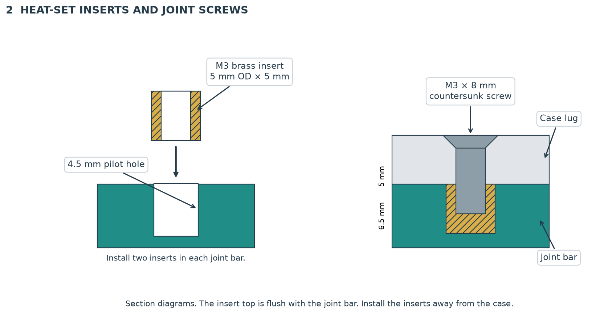
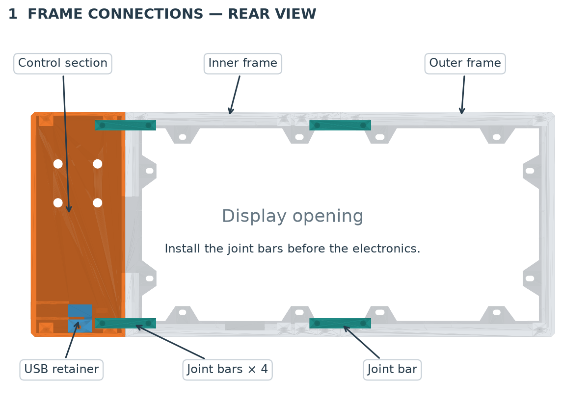
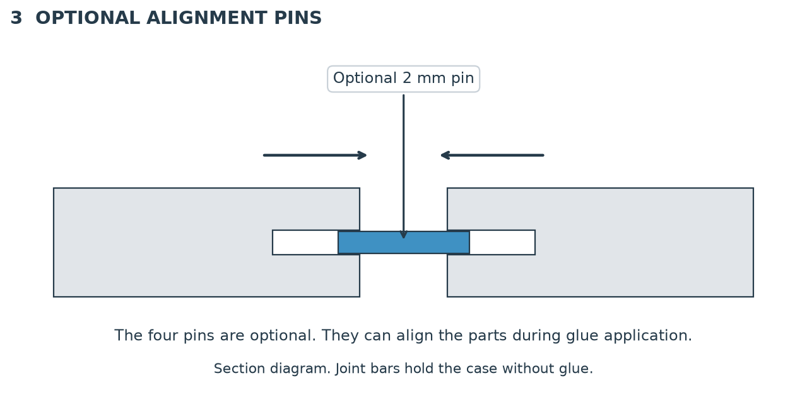
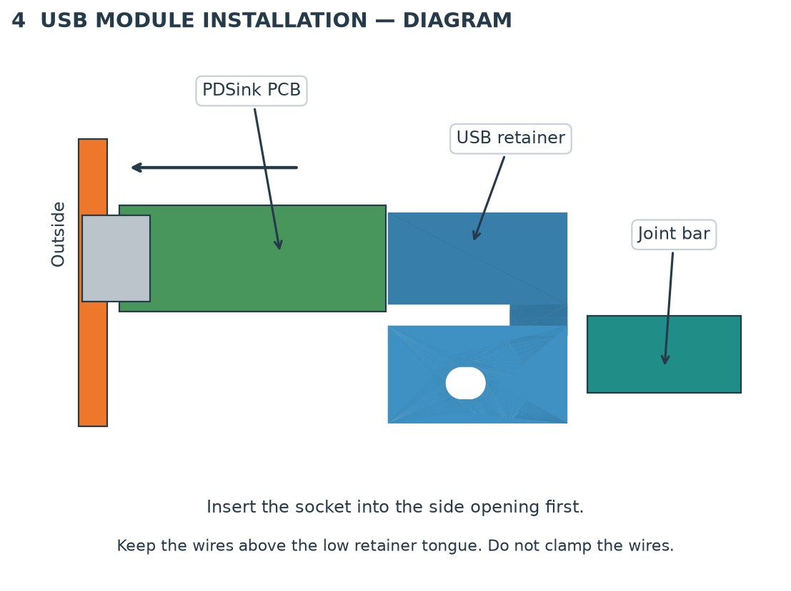
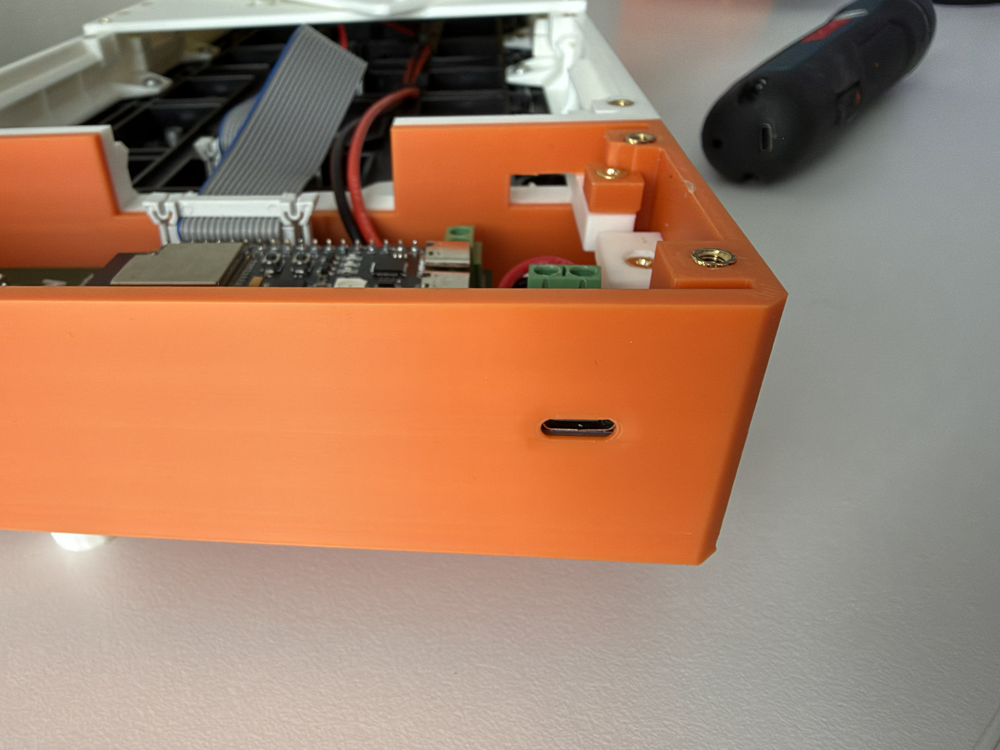
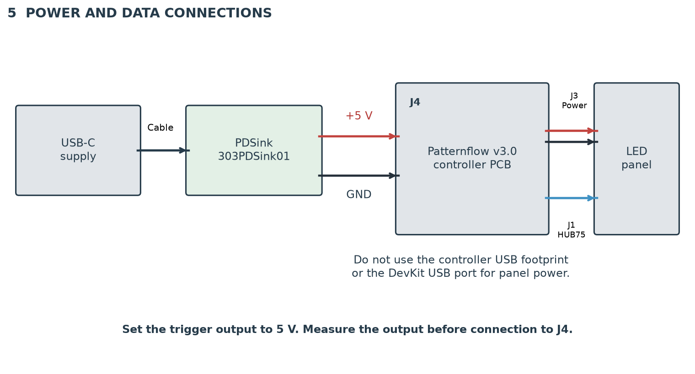
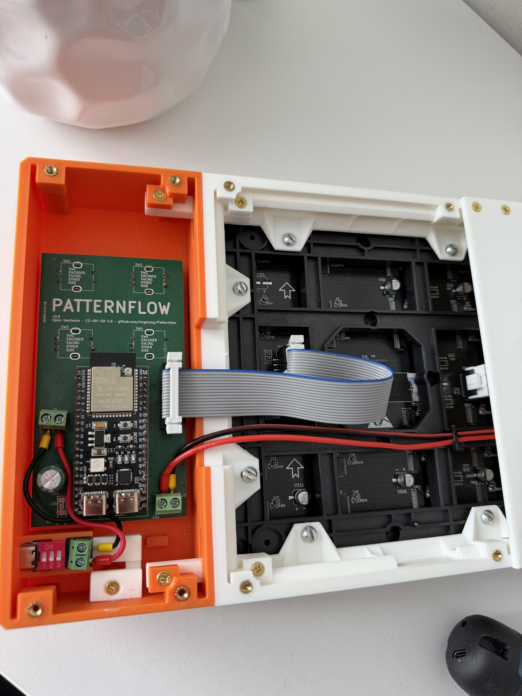

# Assembly instructions

Use the parts in [bom.md](bom.md). Disconnect the supply before mechanical assembly or wire installation.

The **joint bar** connects two front sections. The **USB retainer** holds the separate trigger PCB against its socket location.

The controls are on the right in the front view. They are on the left in the rear view.

## 1. Prepare the printed parts

1. Remove all supports and brims.
2. Remove loose material from the joint channels, PCB guides, and screw holes.
3. Put the three front sections face down on a clean, soft, flat surface.
4. Put the concealed laps into their recesses.
5. Make sure that the front faces are flush.
6. If a joint does not close, remove the obstruction before you continue.

Do not use screws to pull a distorted frame flat.

## 2. Install the brass inserts

1. Put the four joint bars on a heat-resistant surface, away from the enclosure.
2. Use a temperature-controlled insert tool to install two M3 inserts in each bar.
3. Make each insert top flush with the bar surface.
4. Let the bars cool on a flat surface.
5. Make sure that each bar is straight.
6. Install the 16 rear cover inserts in their case bosses.
7. Install one insert in the USB retainer screw boss.
8. Let all inserts cool before screw installation.

Use the insert tool supplier's procedure for PLA. Keep the tool away from visible surfaces.

## 3. Connect the front sections

1. Keep the three front sections face down.
2. Slide one joint bar beneath each pair of joint lugs.
3. Point the insert openings toward the rear of the enclosure.
4. Install two M3 × 8 mm countersunk screws through each lug pair into its bar.
5. Leave the screws loose initially.
6. Hold the joint closed with the front faces flush.
7. Tighten the two screws alternately until the joint is secure.
8. Repeat the procedure for all four bars.
9. Make sure that all three sections remain connected with the rear covers removed.

The joint lug holes and rear cover insert holes are separate. Do not put joint screws into the cover insert holes.

### Optional alignment pins and glue

The four small printed pins are optional. They locate the parts and can guide them during glue application.

The joint bars provide the mechanical connections. Glue is not required.

1. If you use the pins, put them in the four alignment locations before you close the joints.
2. Make sure that each pin permits the joint to close fully.
3. If a pin holds a joint open, remove it.
4. If you use glue, first assemble the joints without glue to confirm the fit.
5. Apply a small quantity of PLA-compatible glue to the mating faces as specified by its manufacturer.
6. Keep glue away from the visible faces, inserts, PCB guides, and electronics.
7. Align the parts with the pins during glue application.
8. Keep the joints aligned until the glue has cured.

## 4. Install the panel and controller

1. Put the LED panel in the frame with its display face toward the front.
2. Make sure that its power and data connectors face the internal cable passage.
3. Make sure that the rear components do not contact the joint bars.
4. Install the panel with its correct mounting screws.
5. Tighten the panel screws gradually.
6. Make sure that the frame joints stay closed.
7. Install the controller with the encoder shafts through the control section.
8. Install the encoder washers and nuts.
9. Tighten the nuts until the controller is secure.

If a joint opens, stop before you tighten the screws further. Correct the cause before you continue.

## 5. Install the separate USB module

1. Put the module into its guides, with the socket first.
2. Keep the components toward the open rear of the enclosure.
3. Seat the socket behind the side opening.
4. Put the USB retainer against the rear PCB edge.
5. Keep the output wires above the low retainer tongue.
6. Install the M3 × 8 mm countersunk retainer screw.
7. Tighten the screw only until the module is secure.
8. Make sure that the retainer does not contact the adjacent joint bar.
9. With the supply disconnected, insert and remove the USB-C cable gently.
10. Make sure that the plug seats fully and the PCB stays in position.

Do not use the retainer to force the module into position. Do not clamp wires beneath the retainer.

## 6. Connect power and data

**CAUTION: The trigger output must be 5 V. A higher voltage can damage the controller and panel.**

1. With the supply disconnected, set the trigger to 5 V according to the module manufacturer's instructions.
2. Keep the trigger output disconnected from J4.
3. Connect the USB-C supply to the trigger.
4. Measure the trigger output voltage and polarity with a multimeter.
5. If the output is not 5 V with the correct polarity, stop.
6. Disconnect the supply.
7. Connect the module's positive output to J4 +5 V.
8. Connect the module's negative output to J4 GND.
9. Connect the panel power cable to J3.
10. Connect the HUB75 ribbon cable between J1 and the panel input.
11. Make sure that the ribbon cable orientation agrees with the connector keys and panel labels.
12. Make sure that all terminals are secure and no bare conductor can contact another connection.
13. Keep the wires clear of screws, joint bars, and cover edges.

**J4 is the controller's only power input.** Do not use the controller USB footprint or DevKit USB port for panel power.

The diagram shows the connections, not the physical terminal order. Use the labels on the actual boards.

## 7. Close the enclosure

1. Make sure that all supports and loose objects are removed from the enclosure.
2. Put the two rear covers in position.
3. Make sure that the covers seat without pressure on wires or components.
4. Install the 16 rear cover screws.
5. Tighten the screws until the covers are secure.
6. Install the four knobs on the encoder shafts.
7. Put one stand at each lower end of the enclosure.
8. Put the enclosure on a stable, flat surface.
9. Connect the supply.
10. Make sure that the display and all four controls operate correctly.

Follow the original [build guide](../../../../BUILD_GUIDE.md) for controller setup and operation.
