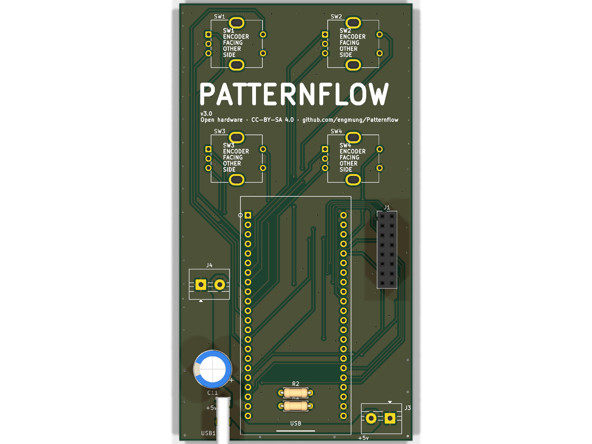
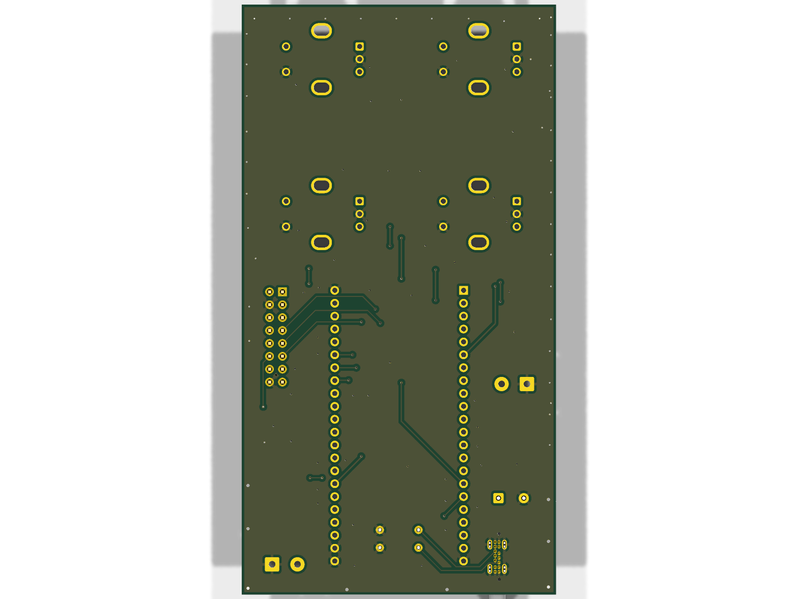
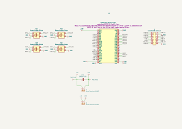

# Patternflow PCB

Custom board for the Patternflow LED synthesizer — ESP32-S3 DevKit on sockets, four EC11 encoders, HUB75 out, hybrid power input. KiCad 10 project.

**Current revision: v3.0** — fabricated, assembled, and verified, including both power inputs ([#114](https://github.com/engmung/Patternflow/issues/114)). All through-hole, no SMD passives; every part is listed by MPN in the [BOM](../bom/).

## Board

| Front | Back |
| :---: | :---: |
|  |  |

- **U1** — ESP32-S3 DevKit (N16R8) on 2× 1×22 female sockets; the DevKit itself is never soldered
- **SW1–SW4** — EC11 rotary encoders, inserted from the **back** (silkscreen reminds you: *encoder facing other side*)
- **J1** — 2×8 socket to the LED matrix (HUB75)
- **Power, two options on one board**: **USB1** (Type-C, needs the R1/R2 5.1k CC pull-downs; the THT signal pins are hard to solder — see [#114](https://github.com/engmung/Patternflow/issues/114)) or **J4** (2-pin screw terminal on the back — the beginner bypass: strip a USB cable, screw the wires in)
- **J3** — +5V out to the LED matrix · **C11** — 1000µF bulk cap for the boot transient

## Schematic



Also available as [`schematic.pdf`](schematic.pdf) (no KiCad required).

## Ordering

Upload [`gerber/patternflow_v3.0_gerber.zip`](gerber/) to your fab of choice.

| Gerber | Status |
|---|---|
| `patternflow_v3.0_gerber.zip` | ✅ **Order this** — current, verified |
| `patternflow_v2.1_gerber.zip` | Legacy — last v2.x board. Only for [v2 builds](https://github.com/engmung/Patternflow/releases/tag/v2.1.0); **does not fit the v3 cases** |
| `patternflow_v1.0_gerber.zip` / `v2.0` | Archived early revisions |
| `gerber/experiment/` | Unverified WIP — never order from here |

## Folder layout

- `kicad/` — editable KiCad 10 source (`patternflow.kicad_pro/sch/pcb` + local footprint/3D libs)
- `gerber/` — fab-ready zips, one per revision
- `images/` — renders + schematic export for this README
- `schematic.pdf` — printable schematic

## Regenerating outputs

After editing the KiCad source (paths relative to `hardware/pcb/`):

```sh
# Gerbers + drill (matches the repo zip convention)
kicad-cli pcb export gerbers --no-protel-ext -o out/ kicad/patternflow.kicad_pcb
kicad-cli pcb export drill --excellon-separate-th --generate-map --map-format gerberx2 -o out/ kicad/patternflow.kicad_pcb

# Schematic PDF + SVG
kicad-cli sch export pdf -o schematic.pdf kicad/patternflow.kicad_sch
kicad-cli sch export svg -e -o images/ kicad/patternflow.kicad_sch

# Board renders
kicad-cli pcb render --side top    --quality high -w 1600 -h 1200 -o images/board_render_top.png    kicad/patternflow.kicad_pcb
kicad-cli pcb render --side bottom --quality high -w 1600 -h 1200 -o images/board_render_bottom.png kicad/patternflow.kicad_pcb
```

## License

CC-BY-SA 4.0 — see the root [LICENSE-CC-BY-SA](../../LICENSE-CC-BY-SA).
